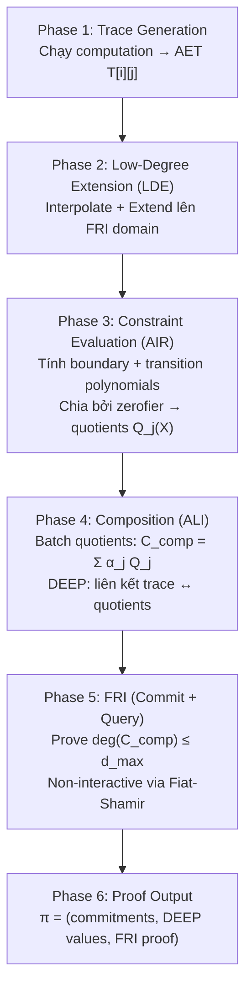
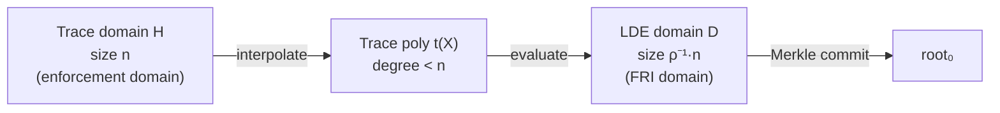
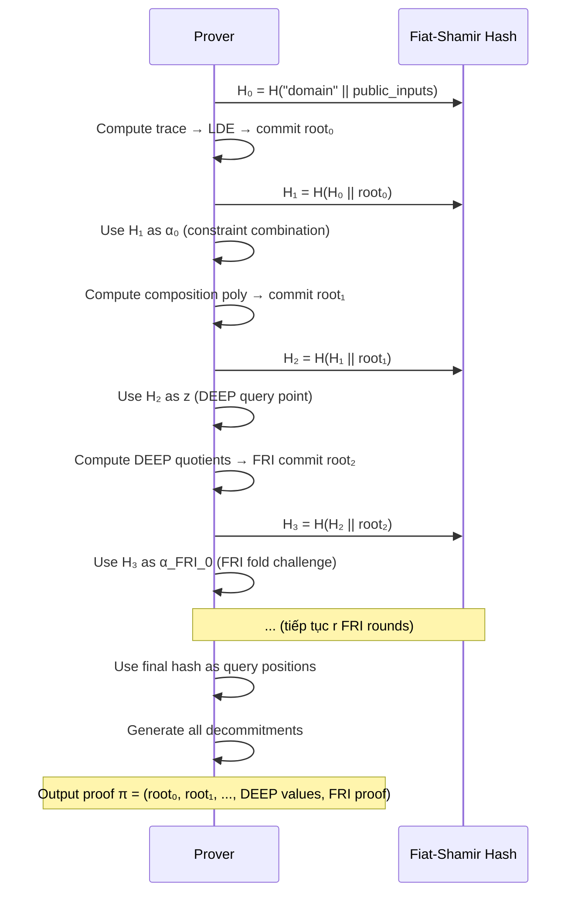

> **Prerequisites**: [[03-starks-air-arithmetization|L03]] — AIR, quotient polynomials; [[04-fri-commit-fold|L04]], [[05-fri-query-verification|L05]] — FRI commit + query
> **Objectives**:
> - Ghép toàn bộ STARK pipeline từ computation → proof → verify
> - Hiểu Low-Degree Extension (LDE) và tại sao cần
> - Nắm DEEP-ALI: liên kết AIR checks với FRI
> - Hiểu STARK non-interactive qua Fiat-Shamir
> - Phân tích proof size, prover time, verifier time
> - Nhận diện attack vectors liên quan đến pipeline tổng thể

---

## Nhìn Lại: STARK = AIR + FRI + Fiat-Shamir

Sau 5 bài trước, ta đã có:

| Công cụ | Từ bài | Vai trò trong STARK |
|---------|--------|---------------------|
| Finite fields, polynomial | L01 | Nền toán học |
| Roots of unity, NTT | L01 | Evaluation domain, NTT |
| Reed-Solomon code | L01 | Codeword framework cho FRI |
| IOP model | L02 | Framework protocol |
| Fiat-Shamir | L02 | Non-interactive transformation |
| Execution trace, AIR | L03 | Encode computation |
| Quotient polynomials | L03 | Reduce constraint → low-degree |
| FRI commit phase | L04 | Commit polynomial, fold |
| FRI query phase | L05 | Spot-check, colinearity |

Bài này ghép tất cả lại thành **một pipeline hoàn chỉnh**.

---

## Overview: 6 Phases của STARK



---

## Phase 1: Trace Generation

*Đã chi tiết trong L03. Tóm tắt nhanh:*

Prover chạy computation → ma trận $T \in \mathbb{F}^{n \times w}$ với $n$ rows (steps) và $w$ columns (registers).

**Constraint của trace**: $n$ phải là lũy thừa 2 (để dùng NTT). Nếu computation có $N$ bước không phải lũy thừa 2, pad với **dummy rows** đến $n = 2^{\lceil \log_2 N \rceil}$.

> [!danger] Bug Class: Incorrect Padding
> Nếu dummy rows không thỏa mãn transition constraints (ví dụ: giá trị không bằng 0 hoặc không phải giá trị "neutral"), thì AIR constraint bị vi phạm tại các bước padding.
>
> **Fix**: Boundary constraints phải chỉ định rõ scope — constraints chỉ áp dụng cho $i = 0, \ldots, N-1$ (không phải rows padding).

---

## Phase 2: Low-Degree Extension (LDE)

Đây là bước quan trọng thường bị giải thích thiếu.

> [!definition] Definition 6.1 — Low-Degree Extension
> Cho trace domain $H = \{\omega^0, \ldots, \omega^{n-1}\}$ (bậc $n$) và LDE domain $D$ với $|D| = \rho^{-1} \cdot n$ (blowup factor lần lớn hơn):
>
> 1. Interpolate mỗi cột $j$ → trace polynomial $t_j(X)$ bậc $< n$ trên $H$
> 2. Evaluate $t_j$ trên toàn bộ $D$ → extended codeword $\{t_j(x) : x \in D\}$

**Tại sao cần LDE?**

Nếu chỉ commit trên $H$, verifier query cùng domain như prover compute. Nhưng với Reed-Solomon proximity testing (FRI), cần domain **lớn hơn nhiều** so với degree — đây là blowup factor $\rho^{-1}$.

> *Hiểu trực quan*: Một polynomial "cao bậc" giả mạo sẽ khác với polynomial "đúng" ở **hầu hết** điểm trong $D$ — nhưng chúng có thể trùng nhau trên $H$ (vì constraint chỉ enforce trên $H$). LDE "mở rộng" domain để FRI có thể phân biệt.



---

## Phase 3: Constraint Evaluation — Composition Polynomial

*Chi tiết trong L03. Phần mới ở đây là composition.*

Sau khi tính các quotient polynomials $Q_j^{(B)}$ (boundary) và $Q_j^{(T)}$ (transition), verifier gửi random coefficients $\alpha_j$ để **batch** chúng:

> [!definition] Definition 6.2 — Composition Polynomial (ALI)
> $$C_{\text{comp}}(X) = \sum_j \alpha_j^{(B)} \cdot X^{d_{\max} - \deg Q_j^{(B)}} \cdot Q_j^{(B)}(X) + \sum_k \alpha_k^{(T)} \cdot X^{d_{\max} - \deg Q_k^{(T)}} \cdot Q_k^{(T)}(X)$$
>
> Degree correction $X^{d_{\max} - \deg Q_j}$ đảm bảo mọi summand đều có cùng degree $d_{\max}$.
>
> **Iff computation đúng**: $C_{\text{comp}}$ là polynomial bậc $\leq d_{\max}$.

> [!theorem] Theorem 6.3 — Composition Polynomial Soundness
> Nếu computation **sai** (ít nhất một constraint bị vi phạm), thì với random $\alpha_j$:
>
> $$\Pr[C_{\text{comp}} \text{ có bậc} \leq d_{\max}] \leq \epsilon_{\text{ALI}} \approx \frac{N_{\text{constraints}} \cdot d_{\max}}{|\mathbb{F}|}$$

---

## Phase 4: DEEP-ALI — Liên kết Trace với Composition

Đây là kỹ thuật then chốt cho STARK soundness hiện đại.

**Vấn đề**: FRI prove $C_{\text{comp}}$ low-degree, nhưng verifier cần confirm rằng $C_{\text{comp}}$ được tính **đúng** từ trace polynomials $t_j$. Nếu không, prover có thể dùng bất kỳ low-degree polynomial nào không liên quan đến trace.

**DEEP solution**: Verifier gửi random challenge $z \notin D$ (outside evaluation domain). Prover cung cấp evaluations:

$$t_j(z) = v_j, \quad t_j(\omega \cdot z) = v_j', \quad Q_k^{(T)}(z^S) = u_k$$

Verifier kiểm tra rằng $C_{\text{comp}}(z)$ được tính đúng từ các giá trị này. Sau đó, DEEP quotients được tính:

> [!definition] Definition 6.4 — DEEP Composition Polynomial
> $$F(X) = \sum_j \alpha_j \cdot \frac{t_j(X) - t_j(z)}{X - z} + \sum_j \beta_j \cdot \frac{t_j(X) - t_j(\omega z)}{X - \omega z} + \sum_k \gamma_k \cdot \frac{Q_k(X) - Q_k(z^S)}{X - z^S}$$
>
> Nếu prover đã compute tất cả polynomials đúng, $F(X)$ là low-degree (bậc $< n$). FRI prove điều này.

---

## Phase 5: FRI (Non-Interactive)

*Chi tiết trong L04, L05. Phần mới: Fiat-Shamir.*

Toàn bộ interactive protocol được biến thành non-interactive bằng cách thay verifier messages bằng hash:



> [!danger] Bug Class: Channel / Transcript Ordering Errors
> Một lỗi tinh tế trong implementation: thứ tự message trong transcript sai. Ví dụ:
> - Prover hash `root₀` để lấy `α₀` **trước** khi gửi `root₀` — không có ý nghĩa vì hash chưa "commit" tới `root₀`
> - DEEP challenge `z` được derive **trước** khi prover commit composition polynomial
>
> **Kết quả**: Prover có thể chọn `root₀` **sau** khi biết challenge → grinding attack.

---

## Verifier Algorithm

Verifier nhận proof $\pi$ và thực hiện:

```
function STARK_Verify(π, public_inputs):
    (root₀, root₁, ..., DEEP_vals, FRI_proof) = π
    
    // 1. Recompute tất cả challenges qua Fiat-Shamir
    H₀ = H("domain" || public_inputs)
    α₀ = H(H₀ || root₀)        // constraint combination
    z  = H(α₀ || root₁)         // DEEP query point
    ...
    
    // 2. DEEP check: verify C_comp(z) consistent với DEEP_vals
    expected = compute_composition(DEEP_vals, z, public_constraints)
    assert expected == DEEP_vals["C_comp_at_z"]
    
    // 3. FRI verify: check deg(F_DEEP) ≤ d_max
    assert FRI_Verify(FRI_proof, root_DEEP, d_max, query_positions)
    
    // 4. Boundary checks: verify specific DEEP values match public inputs
    assert DEEP_vals["t₀(z)"] consistent with boundary constraints
    
    return ACCEPT
```

**Verifier complexity**: $O(\lambda \cdot \log^2 n)$ — poly-logarithmic trong trace size!

---

## Full Implementation Demo

```python
# =============================================================
# Full STARK Pipeline — Minimal End-to-End Demo
# Computation: Fibonacci sequence (như L03)
# =============================================================
import hashlib
from sympy import factorint

p = 2013265921  # BabyBear

def mod_inv(a, p): return pow(a, p-2, p)

def get_omega(n, p):
    factors = list(factorint(p-1).keys())
    for g in range(2, p):
        if all(pow(g, (p-1)//q, p) != 1 for q in factors):
            return pow(g, (p-1)//n, p)

def poly_eval(coeffs, x, p):
    result = 0
    for c in reversed(coeffs): result = (result * x + c) % p
    return result

def lagrange_interp(ys, domain, p):
    n = len(ys)
    result = [0] * n
    for i in range(n):
        num, den = [1], 1
        for j in range(n):
            if i == j: continue
            new_num = [0] * (len(num) + 1)
            for k, c in enumerate(num):
                new_num[k+1] = (new_num[k+1] + c) % p
                new_num[k] = (new_num[k] - c * domain[j]) % p
            num = new_num
            den = den * ((domain[i] - domain[j]) % p) % p
        scale = ys[i] * mod_inv(den, p) % p
        while len(result) < len(num): result.append(0)
        for k, c in enumerate(num): result[k] = (result[k] + scale * c) % p
    return result

def merkle_root(values):
    import hashlib
    layer = [hashlib.sha256(v.to_bytes(8, 'big')).digest() for v in values]
    while len(layer) > 1:
        layer = [hashlib.sha256(layer[i] + layer[i+1]).digest()
                 for i in range(0, len(layer), 2)]
    return layer[0]

def fiat_shamir(state, *data):
    h = hashlib.sha256(state)
    for d in data:
        if isinstance(d, bytes):
            h.update(d)
        elif isinstance(d, int):
            byte_len = (d.bit_length() + 7) // 8 or 1
            h.update(d.to_bytes(byte_len, 'big'))
        else:
            h.update(str(d).encode())
    return h.digest()

# ---- Phase 1: Build Fibonacci Trace ----
n = 8  # trace size (must be power of 2)
omega_H = get_omega(n, p)
H = [pow(omega_H, i, p) for i in range(n)]

trace_a = [0] * n
trace_b = [0] * n
trace_a[0], trace_b[0] = 1, 1
for i in range(1, n):
    trace_a[i] = trace_b[i-1] % p
    trace_b[i] = (trace_a[i-1] + trace_b[i-1]) % p

print("=== Phase 1: Execution Trace ===")
print(f"Fibonacci: a[{n-1}] = {trace_a[-1]}, b[{n-1}] = {trace_b[-1]}")

# ---- Phase 2: LDE ----
blowup = 4
n_lde = n * blowup
omega_D = get_omega(n_lde, p)
D = [pow(omega_D, i, p) for i in range(n_lde)]

t_a_coeffs = lagrange_interp(trace_a, H, p)
t_b_coeffs = lagrange_interp(trace_b, H, p)

t_a_lde = [poly_eval(t_a_coeffs, x, p) for x in D]
t_b_lde = [poly_eval(t_b_coeffs, x, p) for x in D]

root_trace = merkle_root(t_a_lde + t_b_lde)
print(f"\n=== Phase 2: LDE ===")
print(f"LDE domain size: {n_lde} (blowup={blowup}x)")
print(f"Trace commitment (root): {root_trace.hex()[:16]}...")

# ---- Phase 3: Constraint Evaluation ----
# Transition constraint C1: t_a(omega*X) - t_b(X) = 0 at steps 0..n-2
# Symbolically: on LDE domain, evaluate and check
# (simplified: we check directly on H)
constraint_violations = 0
for i in range(n-1):
    c1 = (trace_a[i+1] - trace_b[i]) % p
    c2 = (trace_b[i+1] - trace_a[i] - trace_b[i]) % p
    if c1 != 0 or c2 != 0:
        constraint_violations += 1

print(f"\n=== Phase 3: Constraint Check ===")
print(f"Constraint violations on honest trace: {constraint_violations} (expected 0)")

# ---- Phase 4: DEEP Point + Composition (simplified) ----
state = fiat_shamir(b"stark_fib_v1", int.from_bytes(root_trace, 'big'))
alpha = int.from_bytes(state[:8], 'big') % p
state2 = fiat_shamir(state, alpha)
z = int.from_bytes(state2[:8], 'big') % p

# DEEP values: evaluate trace polynomials at z
t_a_z = poly_eval(t_a_coeffs, z, p)
t_b_z = poly_eval(t_b_coeffs, z, p)
t_a_wz = poly_eval(t_a_coeffs, omega_H * z % p, p)
t_b_wz = poly_eval(t_b_coeffs, omega_H * z % p, p)

print(f"\n=== Phase 4: DEEP-ALI ===")
print(f"DEEP point z = {z % 10000}... (outside domain)")
print(f"t_a(z) = {t_a_z % 10000}..., t_b(z) = {t_b_z % 10000}...")
print(f"t_a(wz) = {t_a_wz % 10000}..., t_b(wz) = {t_b_wz % 10000}...")

# Verify transition constraint at DEEP point
C1_at_z = (t_a_wz - t_b_z) % p
C2_at_z = (t_b_wz - t_a_z - t_b_z) % p

# Build DEEP quotient F = (t_a(X) - t_a(z)) / (X - z) at a test point
test_x = D[3]
numerator_a = (poly_eval(t_a_coeffs, test_x, p) - t_a_z) % p
denominator = (test_x - z) % p
F_test_a = numerator_a * mod_inv(denominator, p) % p

print(f"C1(z) = {C1_at_z} (should be 0 for honest trace, but z is outside H so: {C1_at_z != 0})")
print(f"DEEP quotient F at test point: {F_test_a % 10000}...")

# ---- Phase 5: Proof Summary ----
print(f"\n=== Phase 5: Proof Summary ===")
proof = {
    "root_trace": root_trace.hex()[:16] + "...",
    "DEEP_values": {
        "t_a_z": t_a_z % (10**6),
        "t_b_z": t_b_z % (10**6),
        "t_a_wz": t_a_wz % (10**6),
        "t_b_wz": t_b_wz % (10**6),
    },
    "FRI_proof": "[FRI proof would go here — see L04/L05]",
    "public_inputs": {"F_start_a": 1, "F_start_b": 1, "n": n}
}
for k, v in proof.items():
    print(f"  {k}: {v}")

print("\n✅ Pipeline demo complete")
```

---

## Proof Size & Complexity

> [!note] Remark — STARK Complexity Summary
>
> | | Complexity | Typical size |
> |----|-----------|-------------|
> | Prover time | $O(n \log n)$ | |
> | Verifier time | $O(\lambda \log^2 n)$ | |
> | Proof size | $O(\lambda \log^2 n)$ hash values | 200–500 KB |
> | Trusted setup | None | — |
> | Post-quantum | Yes (hash-based) | — |
>
> **Comparison**:
> - Groth16: ~200 bytes proof, $O(n)$ prover, setup cần
> - STARK: ~200-500 KB proof, $O(n \log n)$ prover, no setup, post-quantum

---

## Attack Surface của Full Pipeline

```mermaid
graph TD
    T["Trace Generation"] --> T1["Padding bug → wrong constraint scope"]
    L["LDE"] --> L1["Wrong blowup → FRI domain too small"]
    L --> L2["Mismatched omega (trace vs FRI domain)"]
    C["Constraint Eval"] --> C1["Under-constrained AIR"]
    C --> C2["Wrong degree bound → degree mismatch"]
    A["ALI / DEEP"] --> A1["Transcript ordering error → grinding"]
    A --> A2["z ∈ D (DEEP point inside domain)"]
    A --> A3["Degree correction missing"]
    F["FRI"] --> F1["Insufficient queries"]
    F --> F2["Batching coefficient leaked early"]
    F --> F3["Colinearity check skipped"]
    V["Verifier"] --> V1["Boundary check incomplete"]
    V --> V2["DEEP consistency check missing"]
```



---

## Key Takeaways

- **6 phases**: Trace → LDE → Constraint eval → DEEP-ALI composition → FRI → Proof.
- **LDE** là bước mở rộng trace lên domain lớn hơn $\rho^{-1}$ lần cho FRI proximity test.
- **DEEP-ALI** liên kết AIR constraints với FRI: prover cung cấp evaluation tại random point $z$, verifier verify consistency.
- **Fiat-Shamir** biến toàn bộ protocol thành non-interactive: tất cả verifier challenges được derive từ hash của transcript trước đó.
- **Verifier complexity** $O(\lambda \log^2 n)$ — poly-log trong trace size, rất nhanh.
- **Attack surface**: mọi interface giữa các phase đều là điểm nguy hiểm. Đặc biệt: transcript ordering, DEEP point selection, degree correction.

---

## Self-Check

1. Tại sao LDE domain $D$ phải **lớn hơn nhiều** trace domain $H$? Điều gì xảy ra nếu $|D| = |H|$ (blowup = 1)?
2. Trong DEEP-ALI, tại sao $z$ phải ở **ngoài** $D$ ($z \notin D$)? (Gợi ý: liên hệ với DEEP quotient từ L05.)
3. Nếu prover biết trước DEEP challenge $z$ (trước khi commit trace), họ có thể làm gì?
4. Tính verifier time khi $n = 2^{20}$, $\lambda = 128$, $\rho = 1/4$. So sánh với prover time $O(n \log n)$.
5. *(Bug Bounty)* Một STARK implementation tính composition polynomial như sau: $C_{\text{comp}} = \sum_j \alpha_j \cdot Q_j$ (không có degree correction). Điều này dẫn đến bug gì? Làm thế nào exploit?

---

## References

- Hexens — *Zero-Knowledge in STARKs: DEEP Composition for Transparent Proofs*: https://hexens.io/blog/zk-in-starks
- StarkWare — *StarkDEX Deep Dive: the STARK Core Engine*: https://medium.com/starkware/starkdex-deep-dive-the-stark-core-engine-497942d0f0ab
- RISC Zero — *STARK by Hand*: https://dev.risczero.com/proof-system/stark-by-hand
- aszepieniec — *Anatomy of a STARK* (all parts): https://aszepieniec.github.io/stark-anatomy/
- ethSTARK Documentation v1.2: https://eprint.iacr.org/2021/582.pdf
