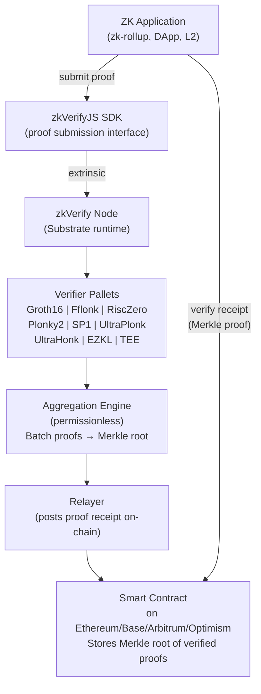
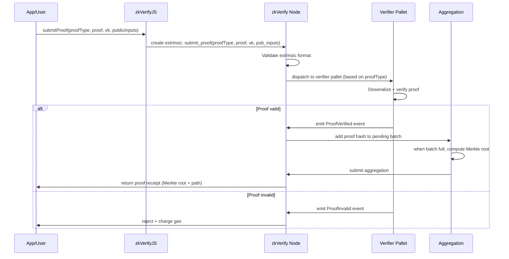
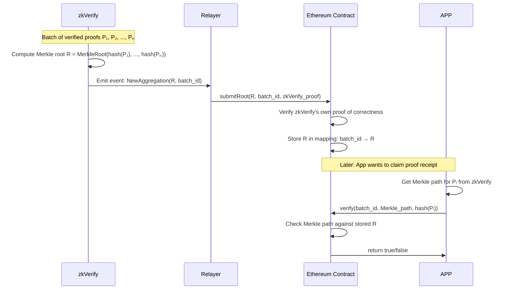

> **Prerequisites**: [[06-full-stark-pipeline|L06]] — Full STARK pipeline; [[02-zero-knowledge-proof-systems|L02]] — Proof systems overview
> **Objectives**:
> - Hiểu zkVerify là gì và tại sao nó tồn tại
> - Nắm kiến trúc Substrate-based L1 blockchain
> - Hiểu cơ chế Verifier Pallets và proof submission flow
> - Hiểu Proof Receipt và on-chain verification
> - Map zkVerify source code: biết tìm code gì ở đâu
> - Chuẩn bị cho bug hunting: attack surface của architecture

---

## zkVerify là gì?

> [!definition] Definition 7.1 — zkVerify
> **zkVerify** là một Layer 1 blockchain chuyên dụng cho **zero-knowledge proof verification**, được phát triển bởi Horizen Labs. Thay vì verify ZK proof trên Ethereum (tốn 200,000–300,000 gas mỗi proof), các ứng dụng có thể offload verification sang zkVerify với chi phí thấp hơn ~91%.
>
> Stack: **Substrate framework** + **NPoS consensus** + **Rust-based verifier pallets** + **VFY token**.

**Tại sao cần một chain riêng?** ZK proof verification là một workload rất đặc biệt: nặng về field arithmetic và hash computation, nhưng rất ít state transition phức tạp. Một chain chuyên dụng có thể:

- Optimize hardware (GPU/FPGA acceleration)
- Dùng STARK-friendly hash functions (Poseidon thay vì SHA-256)
- Batch nhiều proofs cùng lúc để amortize overhead
- Charge rẻ hơn Ethereum do không cạnh tranh blockspace với smart contracts

---

## Kiến Trúc Tổng Quan



*Flow tổng quát: App gửi ZK proof → zkVerify verify → phát proof receipt → App claim receipt on Ethereum.*

---

## Substrate Framework

zkVerify được built trên **Substrate** — framework của Parity/Web3Foundation để xây dựng blockchains tùy chỉnh.

> [!note] Remark — Tại sao Substrate quan trọng cho bug hunting?
> Substrate cung cấp một số primitives mà attacker có thể target:
> - **FRAME pallets**: module code — mỗi pallet có thể có logic lỗi
> - **Extrinsics**: transactions — input validation là điểm đầu tiên cần kiểm tra
> - **Weights system**: DoS protection — nếu weight sai thì có thể DoS chain
> - **Storage**: on-chain state — storage corruption bugs
> - **Consensus (NPoS)**: validator set manipulation

```
zkVerify Codebase Structure (GitHub: zkVerify/zkVerify):

node/                     ← Node implementation
  src/
    command.rs            ← CLI + node setup
    service.rs            ← Node service (networking, consensus)

runtime/                  ← Substrate runtime (on-chain logic)
  src/
    lib.rs                ← Runtime definition, pallet registration
    pallets/              ← Custom pallets

pallets/                  ← Verifier pallets
  groth16/                ← Groth16 verifier
  fflonk/                 ← Fflonk verifier
  risc_zero/              ← RISC Zero verifier
  plonky2/                ← Plonky2 verifier
  sp1/                    ← SP1 verifier
  ultraplonk/             ← UltraPlonk (Noir)
  ultrahonk/              ← UltraHonk (Noir)
  ezkl/                   ← EZKL verifier
  proof_of_existence/     ← Proof receipt pallet

verifiers/                ← Core cryptographic verifier libraries
  groth16/                ← Rust implementation
  fflonk/
  risc_zero/
  ...
```

---

## Proof Submission Flow



---

## Verifier Pallets: Interface Chung

Mọi verifier pallet đều implement một trait chung (simplified):

```rust
// =============================================================
// zkVerify Verifier Pallet Interface (Rust sketch)
// Source: pallets/<proof_type>/src/lib.rs
// =============================================================

// Trait mà mọi verifier phải implement
pub trait Verifier {
    /// Kiểu dữ liệu proof
    type Proof: Decode + Encode;
    /// Kiểu dữ liệu verification key
    type Vk: Decode + Encode;
    /// Kiểu dữ liệu public inputs
    type Pubs: Decode + Encode;

    /// Hàm verify chính — trả về Ok(()) nếu proof valid
    fn verify_proof(
        vk: &Self::Vk,
        proof: &Self::Proof,
        pubs: &Self::Pubs,
    ) -> Result<(), VerifyError>;
}

// Pallet extrinsic — đây là entry point từ on-chain transaction
// #[pallet::call]
// pub fn submit_proof(
//     origin: OriginFor<T>,
//     vk_hash: H256,               // hash của verification key (đã register)
//     proof: ProofOf<T>,           // serialized proof
//     public_inputs: PublicInputsOf<T>, // public inputs
// ) -> DispatchResult {
//     // 1. Validate sender
//     let who = ensure_signed(origin)?;
//
//     // 2. Lookup VK từ storage
//     let vk = Vks::<T>::get(vk_hash).ok_or(Error::<T>::VkNotFound)?;
//
//     // 3. Deserialize proof
//     let proof_data = T::Verifier::Proof::decode(&mut &proof[..])
//         .map_err(|_| Error::<T>::InvalidProofData)?;
//
//     // 4. Run verifier
//     T::Verifier::verify_proof(&vk, &proof_data, &public_inputs)
//         .map_err(|_| Error::<T>::VerificationFailed)?;
//
//     // 5. Emit event + register proof receipt
//     Self::deposit_event(Event::ProofVerified { who, vk_hash, proof_hash });
//     Ok(())
// }

// ---- Bug Hunter: Common Attack Points ----
// 1. Deserialization: proof_data decode — có thể panic? length check?
// 2. VK lookup: storage map — key collision? vk_hash collision?
// 3. verify_proof: phụ thuộc vào cryptographic verifier bên dưới
// 4. Event emission: proof_hash tính thế nào? replay attack?

fn demonstrate_attack_surface() {
    println!("=== zkVerify Pallet Attack Surface ===");
    
    let attack_vectors = vec![
        ("Proof deserialization", "Malformed bytes → panic/OOM → DoS node"),
        ("VK registration bypass", "Submit proof without registering VK → invalid state"),
        ("VK hash collision", "SHA-256 prefix collision → wrong VK used for verification"),
        ("Public inputs mismatch", "Submit proof với pubs khác so với khi generate → accept invalid"),
        ("Replay attack", "Same proof submitted twice → accepted twice → double-spend"),
        ("Gas/weight undercharge", "Verification cost > estimated weight → economic DoS"),
        ("Aggregation manipulation", "Control aggregation batch → exclude/include proofs"),
    ];
    
    for (name, impact) in &attack_vectors {
        println!("  🎯 {}: {}", name, impact);
    }
}
```

---

## Supported Proof Systems: Phân Tích Attack Surface

| Proof System | Pallet | Crypt. Basis | Bug Classes Riêng |
|-------------|--------|-------------|-------------------|
| Groth16 | `pallet-groth16` | Pairing-based | Subgroup check bị skip, public input mismatch |
| Fflonk | `pallet-fflonk` | KZG, EVM-friendly | Transcript format errors, challenge domain |
| RISC Zero | `pallet-risc-zero` | STARK (FRI) | FRI parameter bugs, AIR constraint gaps |
| Plonky2 | `pallet-plonky2` | STARK (FRI, Goldilocks) | Field overflow (p ≈ 2^64), lookup argument bugs |
| SP1 | `pallet-sp1` | STARK (RISC-V) | zkVM instruction encoding, range check bypass |
| UltraPlonk/Honk | `pallet-ultraplonk/k` | Plonk-based | Permutation argument, custom gate bugs |
| EZKL | `pallet-ezkl` | ML-focused SNARK | Float encoding, quantization errors |
| TEE (Intel TDX) | `pallet-tee` | Hardware attestation | Remote attestation forging |

> [!danger] Bug Hunter Priority
> Từ quan điểm bug bounty với phần thưởng cao nhất:
>
> **Tier 1 (Critical, $50K)**: Soundness bug cho phép accept invalid proof
> - RISC Zero pallet: FRI soundness bypass, AIR under-constrained
> - SP1 pallet: zkVM instruction constraint missing
> - Plonky2 pallet: field overflow (Goldilocks p = 2^64 - 2^32 + 1, overflow wraps!)
>
> **Tier 2 (High, $5-20K)**: DoS attacks
> - Any pallet: deserialization panic, OOM
> - Weight miscalculation
>
> **Tier 3 (Medium, $1-5K)**: Logic errors
> - Replay protection missing
> - VK hash collision

---

## Proof Receipt Mechanism



> [!danger] Bug Class: Proof Receipt Manipulation
> **Vấn đề**: Nếu Merkle tree của proof receipts được construct sai (ví dụ: leaf encoding, tree structure), attacker có thể tạo fake Merkle path cho proof không tồn tại.
>
> **Điều cần kiểm tra**:
> - Leaf được encode như thế nào? `H(proof_hash)` hay `H(proof_hash || batch_id)`?
> - Sorted Merkle tree hay unsorted? (Sorted có thể tạo second preimage attack)
> - Domain separation giữa leaf nodes và internal nodes? (Nếu không, length extension attacks)

---

## Đọc Source Code: Hướng Dẫn Thực Tế

```python
# Hướng dẫn clone và navigate zkVerify source
# (Đây là pseudo-code cho quá trình audit)

AUDIT_PLAN = """
=== zkVerify Source Code Navigation ===

1. Clone repo:
   git clone https://github.com/zkVerify/zkVerify
   cd zkVerify

2. Tìm verifier implementations:
   ls pallets/           # danh sách pallets
   ls verifiers/         # core verifier code

3. Cho mỗi verifier pallet, đọc theo thứ tự:
   a) pallets/<name>/src/lib.rs
      → Tìm: submit_proof extrinsic
      → Check: input validation, error handling
   
   b) verifiers/<name>/src/lib.rs
      → Tìm: verify() function
      → Check: field arithmetic, constraint checks
   
   c) verifiers/<name>/src/tests.rs
      → Tìm: test cases
      → Check: edge cases covered?

4. Priority targets cho STARK-based provers:
   pallets/risc_zero/         # RISC Zero (STARK/FRI)
   pallets/plonky2/           # Plonky2 (STARK/FRI, Goldilocks)
   pallets/sp1/               # SP1 (STARK/RISC-V)

5. Kiểm tra Fiat-Shamir implementation:
   grep -r "transcript" verifiers/
   grep -r "challenge" verifiers/
   grep -r "hash" verifiers/

6. Kiểm tra FRI parameters:
   grep -r "num_queries" verifiers/
   grep -r "blowup" verifiers/
   grep -r "fri_" verifiers/

7. Kiểm tra field arithmetic:
   grep -r "overflow" verifiers/
   grep -r "saturating" verifiers/
   grep -r "wrapping" verifiers/  # Goldilocks field wraps at 2^64!
"""

print(AUDIT_PLAN)

# Goldilocks field overflow demo
GOLDILOCKS_P = 2**64 - 2**32 + 1  # Plonky2/Plonky3 field

print("=== Goldilocks Field Overflow Demo ===")
print(f"p = 2^64 - 2^32 + 1 = {GOLDILOCKS_P}")

# Giá trị gần p
a = GOLDILOCKS_P - 1
b = GOLDILOCKS_P - 1
naive_product = a * b  # Trong Python OK, nhưng trong Rust u64 sẽ overflow!
correct_product = (a * b) % GOLDILOCKS_P

print(f"a = p - 1 = {a}")
print(f"a * a = {naive_product} (vượt quá 2^64!)")
print(f"a * a mod p = {correct_product}")
print(f"\nNếu Rust code dùng u64 arithmetic mà không check overflow:")
print(f"  (a * a) as u64 = {naive_product % (2**64)} (wrong!)")
print(f"  Correct = {correct_product}")
print(f"\n→ Field arithmetic overflow = soundness bug tiềm năng! 🚨")
```

---

## zkVerify Bug Bounty Scope

> [!note] Remark — Immunefi Scope (từ lúc viết)
> Bug bounty URL: https://immunefi.com/bug-bounty/zkverify/
>
> **In scope**:
> - `zkVerify/zkVerify` GitHub repo (core node, runtime, pallets, verifiers)
> - Proof verification logic (soundness bugs = Critical)
> - DoS attacks trên node/validator
> - Proof receipt mechanism
>
> **Out of scope**:
> - Frontend/website
> - Already known issues
> - Issues requiring physical access
>
> **Reward tier** (approximate):
> - Critical (soundness): up to $50,000
> - High (DoS, economic): $5,000–$20,000
> - Medium (logic): $1,000–$5,000
> - Low: $100–$1,000

---

## Key Takeaways

- **zkVerify = Substrate L1 chuyên dụng** cho ZK proof verification. Built bởi Horizen Labs, NPoS consensus, VFY token.
- **Architecture**: Submission Interface → Verifier Pallets → Aggregation Engine → Proof Receipts trên Ethereum.
- **Verifier Pallets**: Mỗi proof system có pallet riêng (Groth16, Fflonk, RISC Zero, Plonky2, SP1, UltraPlonk, UltraHonk, EZKL, TEE).
- **STARK-based provers** (RISC Zero, Plonky2, SP1) là target chính vì phức tạp nhất và dựa trên FRI.
- **Attack surface**: deserialization, VK lookup, field arithmetic, Fiat-Shamir transcript, proof receipt Merkle tree.
- **Goldilocks field** (p = 2^64 - 2^32 + 1) trong Plonky2 cần xử lý cẩn thận để tránh overflow.

---

## Self-Check

1. Tại sao zkVerify dùng **Substrate** thay vì build from scratch hoặc dùng Ethereum smart contract?
2. Trong proof submission flow, bước nào là quan trọng nhất để check khi audit? Tại sao?
3. Goldilocks field: $p = 2^{64} - 2^{32} + 1$. Tính $(p-1)^2 \mod p$ một cách đúng. Tại sao Rust `u64` arithmetic sẽ fail ở đây?
4. Proof receipt Merkle tree: tại sao cần domain separation giữa leaf và internal node hashing?
5. *(Bug Bounty)* Khi đọc `pallets/risc_zero/src/lib.rs`, bạn tìm thấy `proof.decode()` không có length check. Tại sao đây có thể là DoS vulnerability? Làm thế nào verify?

---

## References

- zkVerify GitHub: https://github.com/zkVerify/zkVerify
- zkVerify Documentation — Core Architecture: https://docs.zkverify.io/architecture/core-architecture
- zkVerify Immunefi Bug Bounty: https://immunefi.com/bug-bounty/zkverify/
- Horizen Labs Launch Announcement: https://chainwire.org/2024/05/23/horizen-labs-launches-zkverify
- SRL Audit Report 2025: https://github.com/srlabs/audit-reports
