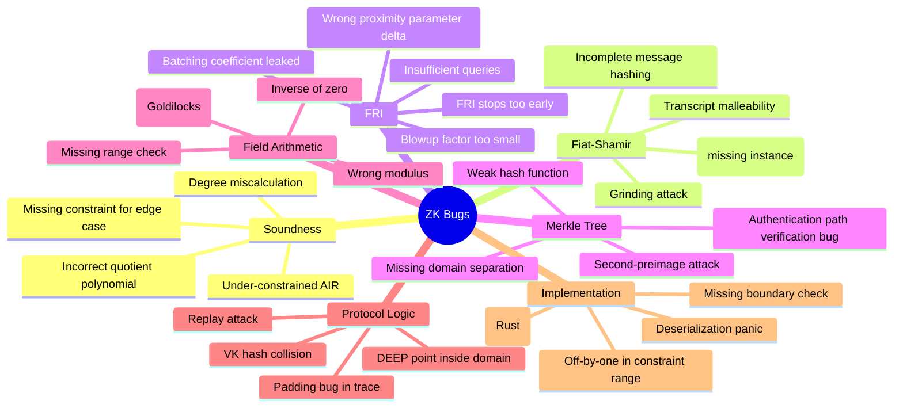

> **Prerequisites**: Tất cả L01–L07
> **Objectives**:
> - Catalog đầy đủ bug classes trong STARK/FRI-based ZK systems
> - Hiểu cơ chế exploit cho từng loại bug
> - Biết cách detect mỗi bug khi đọc code
> - Xây dựng checklist audit cho zkVerify
> - Demo Python: simulate một số attack patterns

---

## Taxonomy: Bug Classes trong ZK Systems



---

## Bug Class 1: Under-Constrained AIR

> [!definition] Recap: Under-Constrained AIR
> AIR thiếu constraints → prover có thể tạo trace "giả" mà vẫn pass verification.

**Ví dụ thực tế**: Trong một zkVM, instruction `ADD` cần constraints:
1. `result = op_a + op_b` (arithmetic)
2. `result < 2^32` (range check — nếu thiếu, có thể overflow)
3. `opcode == ADD_OPCODE` (selector — nếu thiếu, prover có thể claim instruction ADD cho bất kỳ opcode nào)

```python
# =============================================================
# Demo: Under-Constrained AIR — Range Check Missing
# Simulates a simplified VM with ADD instruction
# =============================================================

def verify_add_constrained(op_a: int, op_b: int, result: int, p: int) -> dict:
    """
    Verifier kiểm tra ADD instruction.
    Under-constrained version: chỉ check arithmetic, bỏ qua range check.
    """
    checks = {}
    
    # Constraint 1: arithmetic (cần)
    checks["arithmetic"] = (result == (op_a + op_b) % p)
    
    # Constraint 2: range check (BỊ THIẾU trong under-constrained version!)
    # result PHẢI nằm trong [0, 2^32) để là valid u32
    # Không có constraint này → prover có thể set result = op_a + op_b - p (modular reduction bypass)
    
    return checks

def verify_add_full_constrained(op_a: int, op_b: int, result: int, p: int, u32_max: int = 2**32) -> dict:
    """
    Full constrained version với range check.
    """
    checks = {}
    checks["arithmetic"] = (result == (op_a + op_b) % p)
    checks["range_check"] = (0 <= result < u32_max)  # Range constraint
    checks["op_a_range"] = (0 <= op_a < u32_max)
    checks["op_b_range"] = (0 <= op_b < u32_max)
    return checks

p = 2**31 - 1  # Mersenne prime (simplified)
u32_max = 2**32

print("=== Under-Constrained AIR Demo: Missing Range Check ===")
print("\n--- Honest case: normal addition ---")
op_a, op_b = 100, 200
result_honest = op_a + op_b
checks_under = verify_add_constrained(op_a, op_b, result_honest, p)
checks_full = verify_add_full_constrained(op_a, op_b, result_honest, p)
print(f"ADD({op_a}, {op_b}) = {result_honest}")
print(f"Under-constrained: {checks_under}")
print(f"Full-constrained:  {checks_full}")

print("\n--- Attack: Overflow bypass ---")
# Attacker muốn prove ADD(2^31, 2^31) = 0 (modular overflow)
# Trong chương trình thực, 2^31 + 2^31 should overflow/wrap thành 0 trong u32
# Nhưng trong field arithmetic, đây là valid nếu không có range check
op_a_attack = 2**31
op_b_attack = 2**31
result_attack = (op_a_attack + op_b_attack) % p  # = 1 in this field!
# Attacker dùng field modular reduction: result = 1 (not 0 as u32 would give)
# Nhưng có thể cũng set result = 0 nếu field = 2^32

print(f"Attack: ADD(2^31, 2^31) với result_attack = {result_attack}")
checks_under_attack = verify_add_constrained(op_a_attack, op_b_attack, result_attack, p)
checks_full_attack = verify_add_full_constrained(op_a_attack, op_b_attack, result_attack, p)
print(f"Under-constrained passes: {all(checks_under_attack.values())} ← field gives 2, not 0 — wrong answer!")
print(f"Full-constrained passes:  {all(checks_full_attack.values())} ← 2 is in [0,2^32), so range check alone does NOT catch this")
print("  → Correct fix: constraint must enforce result = (op_a + op_b) mod 2^32 = 0, not just range check")

print("\n--- Deeper: Value larger than field modulus ---")
result_huge = p + 5  # Không phải canonical field element
checks_under_huge = verify_add_constrained(1, p + 4, result_huge, p)
print(f"result = p+5, arithmetic check: {checks_under_huge}")
print("If mod reduction is missing in constraint → non-canonical values accepted 🚨")
```

---

## Bug Class 2: Degree Miscalculation

> [!danger] Bug Class: Quotient Degree Mismatch
> Quotient polynomial $Q(X) = C(X) / Z(X)$ phải có bậc chính xác $\deg(C) - \deg(Z)$.
>
> Nếu implementation tính sai degree bound và FRI chỉ prove polynomial bậc $< d'$ thay vì $< d$ đúng:
> - Nếu $d' > d$: Prover có thể dùng polynomial bậc cao hơn mà FRI vẫn accept → constraint không được enforce đúng
> - Nếu $d' < d$: Completeness fail — honest prover bị reject

```python
def analyze_degree_bounds(n: int, constraint_degree: int) -> dict:
    """
    Tính degree bounds cho quotient polynomials.
    n: trace length (polynomial degree = n-1)
    constraint_degree: degree của transition constraint (thường 1 hoặc 2)
    """
    # Trace polynomial degree
    deg_trace = n - 1
    
    # Transition constraint: C(t(X), t(omega*X)) với constraint degree = k
    # mỗi t(X) có bậc n-1, nên C bậc k*(n-1)
    deg_transition_poly = constraint_degree * (n - 1)
    
    # Transition zerofier: X^(n-1) - 1 bậc n-1 (loại trừ step cuối)
    deg_zerofier_trans = n - 1  # degree of Z_trans = (X^n-1)/(X-omega^(n-1))
    
    # Quotient degree = deg_C - deg_Z
    deg_quotient_trans = deg_transition_poly - deg_zerofier_trans
    
    # Boundary quotient: (t(X) - v)/(X - omega^r) → bậc n-2
    deg_quotient_boundary = n - 2
    
    # Composition polynomial degree = max(deg quotients)
    deg_composition = max(deg_quotient_trans, deg_quotient_boundary)
    
    results = {
        "trace_degree": deg_trace,
        "constraint_degree (on trace)": constraint_degree,
        "transition_poly_degree": deg_transition_poly,
        "zerofier_degree": deg_zerofier_trans,
        "quotient_transition_degree": deg_quotient_trans,
        "quotient_boundary_degree": deg_quotient_boundary,
        "composition_degree": deg_composition,
    }
    return results

print("=== Degree Bound Analysis ===")
for n in [8, 16, 1024]:
    for cdeg in [1, 2, 3]:
        bounds = analyze_degree_bounds(n, cdeg)
        print(f"\nn={n}, constraint_degree={cdeg}:")
        print(f"  Quotient transition: {bounds['quotient_transition_degree']}")
        print(f"  Composition poly:    {bounds['composition_degree']}")
        
        # Simulate degree miscalculation bug
        wrong_bound = bounds['composition_degree'] + n  # off by n
        print(f"  BUGGY bound (off by n): {wrong_bound} ← FRI proves WRONG degree!")
```

---

## Bug Class 3: Fiat-Shamir Attacks

*Recap từ L02 — nhưng đây ta focus vào exploit mechanics cụ thể hơn.*

```python
import hashlib

def fri_challenge_correct(domain_sep: bytes, instance: bytes, 
                          message: bytes, label: bytes, p: int) -> int:
    """Challenge với đầy đủ transcript binding."""
    h = hashlib.sha256()
    h.update(domain_sep)
    h.update(instance)
    h.update(message)
    h.update(label)
    return int.from_bytes(h.digest(), 'big') % p

def fri_challenge_weak(message: bytes, label: bytes, p: int) -> int:
    """BUGGY: thiếu instance — transcript malleable."""
    h = hashlib.sha256()
    h.update(message)  # Thiếu instance!
    h.update(label)
    return int.from_bytes(h.digest(), 'big') % p

p = 2**31 - 1

print("=== Fiat-Shamir Weakness Demo ===\n")

# Scenario: prove statement A và statement B là khác nhau,
# nhưng weak FS cho phép reuse challenge

instance_A = b"statement_A_fibonacci_n=100_result=354224848179261915075"
instance_B = b"statement_B_fibonacci_n=200_result=280571172992510140037611932413038677189525"

message = b"merkle_root_of_trace_abc123"
label = b"fri_alpha_round_0"

alpha_A_correct = fri_challenge_correct(b"stark_v1", instance_A, message, label, p)
alpha_B_correct = fri_challenge_correct(b"stark_v1", instance_B, message, label, p)
alpha_A_weak = fri_challenge_weak(message, label, p)
alpha_B_weak = fri_challenge_weak(message, label, p)

print(f"Correct FS — Challenge for statement A: {alpha_A_correct}")
print(f"Correct FS — Challenge for statement B: {alpha_B_correct}")
print(f"Same challenge (correct)? {alpha_A_correct == alpha_B_correct} ← Should be False!")

print(f"\nWeak FS — Challenge for A: {alpha_A_weak}")
print(f"Weak FS — Challenge for B: {alpha_B_weak}")
print(f"Same challenge (weak)? {alpha_A_weak == alpha_B_weak} ← Both use same challenge! 🚨")
print("→ Proof for statement A can be REUSED for statement B!")

print("\n=== Grinding Attack Feasibility ===")
# Demonstrate: với weak FS, attacker có thể tìm "lucky" commitment
# sao cho challenge có giá trị thuận lợi
import random

def grinding_search(target_bit_prefix: int, max_attempts: int = 1_000_000) -> int:
    """Tìm message sao cho challenge có prefix đặc biệt (low bits)."""
    for attempt in range(max_attempts):
        nonce = attempt.to_bytes(8, 'big')
        # Weak FS: challenge chỉ phụ thuộc vào message, không có instance
        alpha = fri_challenge_weak(b"fake_trace" + nonce, label, p)
        if alpha < 2**target_bit_prefix:  # Tìm challenge nhỏ
            return attempt, alpha
    return None, None

for bits in [8, 12, 16]:
    attempt, alpha = grinding_search(bits, max_attempts=min(2**bits * 10, 500_000))
    if attempt is not None:
        print(f"  Found challenge < 2^{bits}: nonce={attempt}, alpha={alpha} "
              f"(took ~{attempt} attempts, theory ~{2**bits})")
    else:
        print(f"  2^{bits}: no result in search limit")
```

---

## Bug Class 4: Merkle Tree Attacks

```python
import hashlib

def leaf_hash(value: bytes) -> bytes:
    """Correct: domain-separated leaf hash."""
    return hashlib.sha256(b"\x00" + value).digest()  # prefix \x00 cho leaf

def internal_hash(left: bytes, right: bytes) -> bytes:
    """Correct: domain-separated internal hash."""
    return hashlib.sha256(b"\x01" + left + right).digest()  # prefix \x01 cho internal

def leaf_hash_no_sep(value: bytes) -> bytes:
    """BUGGY: no domain separation."""
    return hashlib.sha256(value).digest()

def internal_hash_no_sep(left: bytes, right: bytes) -> bytes:
    """BUGGY: no domain separation."""
    return hashlib.sha256(left + right).digest()

def build_tree(leaves, hash_leaf_fn, hash_internal_fn):
    layer = [hash_leaf_fn(v) for v in leaves]
    while len(layer) > 1:
        layer = [hash_internal_fn(layer[i], layer[i+1])
                 for i in range(0, len(layer), 2)]
    return layer[0]

print("=== Merkle Tree Domain Separation Attack ===\n")

leaves = [f"value_{i}".encode() for i in range(4)]

# Build both trees
root_correct = build_tree(leaves, leaf_hash, internal_hash)
root_buggy   = build_tree(leaves, leaf_hash_no_sep, internal_hash_no_sep)

print(f"Correct tree root: {root_correct.hex()[:16]}...")
print(f"Buggy tree root:   {root_buggy.hex()[:16]}...")

# Second preimage attack on buggy tree
# Một internal node H(left || right) có thể bị coi là leaf hash của (left || right)
left = leaf_hash_no_sep(leaves[0])
right = leaf_hash_no_sep(leaves[1])
fake_leaf_value = left + right  # Concatenation của hai hashes

fake_leaf_hash = leaf_hash_no_sep(fake_leaf_value)  # = H(H(v0) || H(v1))
internal_node_hash = internal_hash_no_sep(left, right)  # = H(H(v0) || H(v1))

print(f"\nSecond preimage attack:")
print(f"H(fake_leaf) = {fake_leaf_hash.hex()[:16]}...")
print(f"Internal node = {internal_node_hash.hex()[:16]}...")
same = fake_leaf_hash == internal_node_hash
print(f"They are equal: {same} {'← ATTACK WORKS! 🚨' if same else '← Correct: attack blocked'}")
print("→ Attacker can claim fake_leaf is in the tree at depth 0 with auth path of depth 1!")
```

---

## Bug Class 5: Field Arithmetic Errors

```python
# =============================================================
# Demo: Field Arithmetic Bugs
# =============================================================

def safe_field_mul(a: int, b: int, p: int) -> int:
    """Correct: Python handles arbitrary precision."""
    return (a * b) % p

def unsafe_u64_mul(a: int, b: int, p: int) -> int:
    """Simulates buggy Rust u64 multiplication without overflow check."""
    # In Rust: a.wrapping_mul(b) without modular reduction
    u64_max = 2**64
    return (a * b) % u64_max  # WRONG: should be % p

print("=== Field Arithmetic Bugs Demo ===\n")

# Goldilocks field
P_GOLDILOCKS = 2**64 - 2**32 + 1
print(f"Goldilocks p = 2^64 - 2^32 + 1 = {P_GOLDILOCKS}")

# Near-max values
a = P_GOLDILOCKS - 1  # -1 in Goldilocks field
b = P_GOLDILOCKS - 1  # -1 in Goldilocks field

correct = safe_field_mul(a, b, P_GOLDILOCKS)  # (-1)*(-1) = 1
buggy   = unsafe_u64_mul(a, b, P_GOLDILOCKS)

print(f"\n(-1) * (-1) in Goldilocks:")
print(f"  Correct: {correct} (should be 1)")
print(f"  Buggy u64: {buggy} (wrong!)")
print(f"  Match: {correct == buggy}")

# Division by zero / inverse of zero
print("\n=== Inverse of Zero Bug ===")
try:
    inv_zero = pow(0, P_GOLDILOCKS - 2, P_GOLDILOCKS)
    print(f"pow(0, p-2, p) = {inv_zero} (0^(p-2) = 0 in Python, not error!)")
    print("→ If code checks 'if inv == 0: error' it works, but if it proceeds...")
    print("  then 0 * anything = 0, which can bypass inverse checks 🚨")
except Exception as e:
    print(f"Error: {e}")

# Off-by-one in constraint range
print("\n=== Off-by-One in Constraint Range ===")
n = 8  # trace size
omega = 3  # simplified omega

print("Transition constraints should apply to steps 0..n-2 (NOT step n-1):")
for off_by in [0, 1]:
    limit = n - 1 - off_by  # correct is n-2; off-by-one is n-1
    steps = list(range(limit + 1))
    print(f"  off_by={off_by}: steps {steps} "
          f"{'← CORRECT' if off_by == 1 else '← BUG: applies to n-1 too, but t(omega*X) at n-1 wraps around!'}")
```

---

## Bug Class 6: STARK-Specific Protocol Bugs

```python
print("=== STARK Protocol Bug Demonstrations ===\n")

# Bug 1: DEEP point inside domain
p = 2013265921
import math
n = 8
def get_omega(n, p):
    from sympy import factorint
    factors = list(factorint(p-1).keys())
    for g in range(2, p):
        if all(pow(g, (p-1)//q, p) != 1 for q in factors):
            return pow(g, (p-1)//n, p)

omega = get_omega(n, p)
D = [pow(omega, i, p) for i in range(n)]

z_in_domain = D[3]   # DEEP point INSIDE domain — BAD
z_outside   = 12345  # DEEP point outside domain — OK (assuming not in D)

print("--- DEEP Point Check ---")
print(f"D = {D[:4]}...")
print(f"z = D[3] = {z_in_domain}: in D? {z_in_domain in D} ← BUG: DEEP point in domain!")
print(f"z = 12345: in D? {z_outside in D} ← OK")

print("\n--- Why z inside D is a bug ---")
print("DEEP quotient: F(X) = (f(X) - f(z)) / (X - z)")
print("If z ∈ D, then (X - z) divides the evaluation domain zerofier!")
print("Prover can choose f(z) = 0 and any f(X) divisible by (X-z)")
print("→ DEEP quotient is trivially low-degree regardless of constraint satisfaction 🚨")

# Bug 2: Replay Attack
print("\n--- Replay Attack Demo ---")
class ProofStore:
    def __init__(self):
        self.verified = set()
    
    def verify_and_record(self, proof_hash: str, with_replay_protection: bool) -> bool:
        if with_replay_protection and proof_hash in self.verified:
            print(f"  REPLAY BLOCKED: {proof_hash[:12]}...")
            return False
        self.verified.add(proof_hash)
        print(f"  ACCEPTED: {proof_hash[:12]}...")
        return True

import hashlib
proof = b"proof_that_i_have_1000_tokens"
proof_hash = hashlib.sha256(proof).hexdigest()

print("Without replay protection:")
store_no_replay = ProofStore()
for attempt in range(3):
    store_no_replay.verify_and_record(proof_hash, with_replay_protection=False)
print("→ Same proof accepted 3 times! 🚨")

print("\nWith replay protection:")
store_replay = ProofStore()
for attempt in range(3):
    store_replay.verify_and_record(proof_hash, with_replay_protection=True)
print("→ Only accepted once ✅")
```

---

## Audit Checklist cho zkVerify

```python
AUDIT_CHECKLIST = """
╔══════════════════════════════════════════════════════════════════════╗
║           zkVerify STARK/FRI Audit Checklist v1.0                   ║
╚══════════════════════════════════════════════════════════════════════╝

[CRITICAL — Soundness]
□ AIR constraints cover ALL registers at ALL steps (no under-constrained)
□ Transition zerofier excludes final row correctly
□ Degree bounds for all quotient polynomials correct
□ Degree correction in composition polynomial present
□ DEEP point z sampled OUTSIDE evaluation domain D
□ DEEP consistency check: C_comp(z) computed from correct trace values
□ FRI domain size = blowup × degree (not just degree)
□ FRI query count sufficient for 128-bit security
□ FRI halts only when polynomial truly constant (or below threshold)

[HIGH — Fiat-Shamir]
□ Domain separator in ALL transcript hashes
□ Public instance (statement) included from round 1
□ Every prover message included before deriving next challenge
□ DEEP challenge z derived AFTER committing all polynomials
□ FRI fold challenges derived from Merkle roots (in order)
□ Query positions derived from FINAL FRI transcript

[HIGH — Field Arithmetic]
□ Goldilocks field: all multiplications use 128-bit intermediate
□ No wrapping_mul/checked_mul without proper mod reduction
□ Range checks for all public inputs (ensure canonical field elements)
□ No division without checking denominator ≠ 0
□ Constraint polynomials evaluated on correct field extension if needed

[MEDIUM — Merkle Tree]
□ Domain separation: leaf vs internal nodes use different hash prefix
□ Merkle path verification checks BOTH index parity and hash
□ Leaf encoding is canonical and fixed-size
□ Proof receipt: leaf encoding includes batch_id (no cross-batch confusion)

[MEDIUM — Protocol Logic]
□ Proof replay protection: nullifier or nonce in proof hash
□ VK registration: hash of VK uses domain-specific prefix
□ Padding rows in trace: boundary constraints scoped correctly
□ Proof deserialization: all inputs length-checked before decode
□ Weight estimation accurate (no DoS via underweight extrinsic)

[LOW — Implementation]
□ Off-by-one in step iteration (0..n-1 vs 0..n-2)
□ Integer overflow checks in Rust (use checked_* or explicit wrapping)
□ Test coverage for edge cases (n=1, n=2, empty trace, max values)
"""
print(AUDIT_CHECKLIST)
```

---

## Key Takeaways

- **Soundness bugs** = Critical. Cho phép prover tạo proof giả. Reward tối đa $50K trên zkVerify.
- **6 nhóm bug chính**: Under-constrained AIR, Degree miscalc, Fiat-Shamir weakness, Merkle attacks, Field arithmetic errors, Protocol logic bugs.
- **Under-constrained AIR**: thiếu constraint → registers tự do → prover gian lận được.
- **Fiat-Shamir**: thiếu instance binding → transcript reuse. Grinding: soundness error quá lớn.
- **Merkle**: thiếu domain separation → second preimage attack.
- **Goldilocks field** ($p = 2^{64} - 2^{32} + 1$): multiplication dễ overflow `u64`.
- **DEEP point**: $z$ phải ngoài domain $D$. Trong domain → soundness bypass trivial.
- **Replay**: proof receipt không có nonce → double-claim.

---

## Self-Check

1. Một zkVM có instruction `ASSERT_EQ(a, b)` với constraint chỉ: `a - b = 0`. Tại sao constraint này có thể bị bypass? Thiếu gì?
2. Transcript hash: `H(root || message)` vs `H(message || root)`. Có gì khác nhau về security không? Tại sao?
3. Trong Rust, `let product: u64 = a * b;` với `a = 2^32, b = 2^32`. Kết quả là gì? Làm thế nào fix?
4. Merkle tree có domain separation với prefix bytes. Tại sao prefix phải là **fixed** (ví dụ `\x00`, `\x01`) thay vì variable-length string?
5. *(Bug Bounty)* Bạn tìm thấy trong `verifiers/risc_zero/src/lib.rs`:
   ```rust
   let z_point = transcript.draw_felt();
   // z_point is used as DEEP evaluation point
   ```
   Không có kiểm tra `z_point ∉ evaluation_domain`. Đây là bug gì? Impact gì? Viết PoC bằng pseudo-code.

---

## References

- SoK: ZKP Vulnerabilities — arxiv.org/pdf/2402.15293 — Comprehensive bug taxonomy
- Ethereum Foundation — *ZK Bug Tracker*: https://github.com/0xPARC/zk-bug-tracker
- Trail of Bits — *How to Audit ZK Circuits*: https://blog.trailofbits.com/2022/04/13/zkdocs/
- aszepieniec — *Anatomy of a STARK* (all parts): https://aszepieniec.github.io/stark-anatomy/
- SRL — *zkVerify Baseline Assurance Report 2025*
