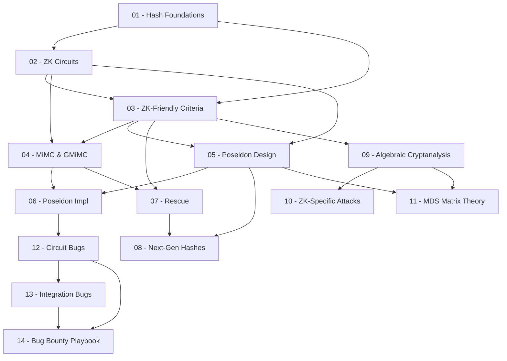

> **Topic**: ZK-Friendly Hash Functions
> **Domain**: Cryptography
> **Level**: Advanced (audit & bug bounty focused)
> **Background assumed**: Mật mã học cơ bản, finite field, elliptic curve theory
> **Tools / Code**: Python + SageMath, Circom, Rust/Halo2
> **Plugin**: LaTeX-like Theorem & Equation Referencer (enabled)
> **Sources**: IACR ePrint, USENIX Security 2021 (Poseidon), Zellic Research, RareSkills, TACEO Blog

---

## Lessons

| # | Title | Key Concepts | Prerequisites | Difficulty |
|---|-------|-------------|---------------|------------|
| 01 | Hash Functions — Nền tảng & Baseline | Định nghĩa, tính chất, SHA-256/Keccak internals, tại sao không ZK-friendly | — | ★★☆☆☆ |
| 02 | ZK Proof Systems & Arithmetic Circuits | R1CS, PLONK, AIR, field arithmetic, constraint cost model | 01 | ★★★☆☆ |
| 03 | Tiêu chí ZK-Friendly & Threat Model | Low-degree maps, multiplicative complexity, SNARKs vs STARKs | 01, 02 | ★★★☆☆ |
| 04 | MiMC & GMiMC | Feistel structure, cube map, round function, constraint count | 02, 03 | ★★★☆☆ |
| 05 | Poseidon — Thiết kế (Phần 1) | HADES strategy, SPN, full/partial rounds, round constants, MDS matrix | 02, 03 | ★★★★☆ |
| 06 | Poseidon — Implementations (Phần 2) | Circom/Halo2 chi tiết, BN254/BLS12-381, Poseidon2, spec vs impl | 04, 05 | ★★★★☆ |
| 07 | Rescue & Rescue-Prime | Inverse S-box, algebraic structure, Rescue-Prime SoK, STARK usage | 03, 04 | ★★★★☆ |
| 08 | Thế hệ mới: Anemoi, Griffin, Reinforced Concrete, Neptune | Flystel, CCZ-equivalence, lookup-friendly, STARK-optimized | 05, 07 | ★★★★★ |
| 09 | Algebraic Cryptanalysis — Cơ bản | Differential, linear cryptanalysis trong algebraic setting, algebraic degree | 03 | ★★★★☆ |
| 10 | Algebraic Attacks Đặc thù ZK Hash | Interpolation attacks, Gröbner basis, GCD attacks, slide/invariant attacks | 09 | ★★★★★ |
| 11 | MDS Matrix & Diffusion Layer | MDS định nghĩa, Cauchy/circulant matrix, branch number, weak configs | 05, 09 | ★★★★☆ |
| 12 | Circuit-Level Bugs — Under/Over-Constrained | Soundness bugs, missing constraints, Circom pitfalls, PoC | 06 | ★★★★★ |
| 13 | Implementation & Integration Bugs | Spec mismatch, domain separation, Fiat-Shamir, hash-to-field, CVEs | 06, 12 | ★★★★★ |
| 14 | Bug Bounty Playbook | Audit checklist, tools (Circomspect, halo2-analyzer, Sage), methodology, report writing | 12, 13 | ★★★★★ |

## Appendix Candidates

| ID | Content | Related Lesson |
|----|---------|----------------|
| A0 | Hash Function Comparison Table — constraints, security, field support | 04–08 |
| A1 | SageMath Scripts — MiMC, Poseidon, Rescue implementations | 04–07 |
| A2 | Circom Bug Pattern Reference | 12, 13 |
| A3 | ZK Hash CVE & Finding Database | 13, 14 |

---

## Dependency Graph

---

## Progress Tracker

- [ ] [[zkverify-series/zk-friendly-hash-functions/00-roadmap|00. Roadmap]]
- [ ] [[01-hash-functions-overview|01. Hash Functions — Nền tảng & Baseline]]
- [ ] [[02-zk-proof-systems-circuits|02. ZK Proof Systems & Arithmetic Circuits]]
- [ ] [[03-zk-friendly-criteria|03. Tiêu chí ZK-Friendly & Threat Model]]
- [ ] [[04-mimc-gmimc|04. MiMC & GMiMC]]
- [ ] [[05-poseidon-design|05. Poseidon — Thiết kế (Phần 1)]]
- [ ] [[06-poseidon-implementations|06. Poseidon — Implementations (Phần 2)]]
- [ ] [[07-rescue-rescue-prime|07. Rescue & Rescue-Prime]]
- [ ] [[08-next-gen-hashes|08. Thế hệ mới: Anemoi, Griffin, Reinforced Concrete, Neptune]]
- [ ] [[09-algebraic-cryptanalysis|09. Algebraic Cryptanalysis — Cơ bản]]
- [ ] [[10-algebraic-attacks-zk|10. Algebraic Attacks Đặc thù ZK Hash]]
- [ ] [[11-mds-matrix-diffusion|11. MDS Matrix & Diffusion Layer]]
- [ ] [[12-circuit-bugs|12. Circuit-Level Bugs — Under/Over-Constrained]]
- [ ] [[13-implementation-integration-bugs|13. Implementation & Integration Bugs]]
- [ ] [[14-bug-bounty-playbook|14. Bug Bounty Playbook]]
- [ ] [[a0-hash-comparison-table|A0. Hash Function Comparison Table]]
- [ ] [[a1-sagemath-scripts|A1. SageMath Scripts]]
- [ ] [[a2-circom-bug-patterns|A2. Circom Bug Pattern Reference]]
- [ ] [[a3-zk-hash-cve-database|A3. ZK Hash CVE & Finding Database]]
