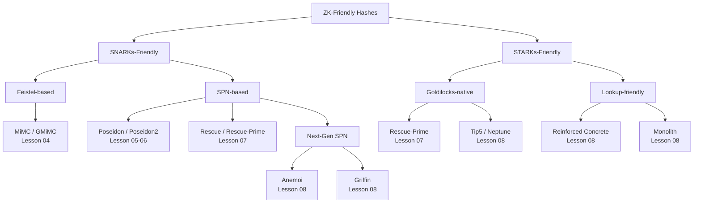

> **Prerequisites**: [[01-hash-functions-overview|01. Hash Functions]], [[02-zk-proof-systems-circuits|02. ZK Proof Systems & Arithmetic Circuits]]
> **Objectives**:
> - Định nghĩa chính xác "ZK-friendly" theo từng chiều: multiplicative complexity, circuit depth, field nativeness
> - Phân biệt SNARKs-friendly vs STARKs-friendly và hiểu tại sao chúng khác nhau
> - Nắm threat model đầy đủ: cả phía mật mã (cryptanalysis) lẫn phía circuit (soundness)
> - Hiểu tại sao tradeoff bảo mật vs hiệu năng trong ZK hashes là khác biệt cơ bản so với hash truyền thống

---

## Motivation

Trước khi đi vào từng hash function cụ thể, cần xây dựng một **framework để đánh giá** bất kỳ ZK-friendly hash nào. Framework này gồm hai phần:

1. **Tiêu chí thiết kế**: Thuộc tính nào làm cho một hash function "tốt" cho ZK?
2. **Threat model**: Adversary có thể tấn công ở đâu, và cần bảo vệ khỏi gì?

Không có framework này, ta sẽ không thể so sánh các hash functions một cách có hệ thống, và không thể xác định khi nào một implementation có bug.

---

## Tiêu chí ZK-Friendly

### Tiêu chí 1: Multiplicative Complexity Thấp

Như đã thấy ở Lesson 02, số phép nhân là chi phí chính. Một ZK-friendly hash cần:

> [!definition] Definition 3.1 — Multiplicative Complexity của Hash Function
> Với hash function $H$ ánh xạ $t-1$ field elements thành $1$ field element (dùng sponge với state $t$), **multiplicative complexity per output element** là:
>
> $$MC(H) = \frac{\text{Tổng số phép nhân trong toàn bộ permutation}}{1}$$
>
> Mục tiêu: $MC(H)$ nhỏ nhất có thể trong khi vẫn an toàn.

**Benchmark thực tế** (trên trường BN254, state t=3):

| Hash | Phép nhân per hash | Lý do |
|------|-------------------|-------|
| SHA-256 | ~20,000+ | Bitwise ops + bit decomposition |
| Poseidon ($R_F=8, R_P=57$) | $(8 \cdot 3) + (57 \cdot 1) = 24 + 57 = 81$ S-boxes, $81 \times 3 = 243$ constraints | Power map $x^5$ |
| MiMC-7 (91 rounds) | $91 \times 2 = 182$ mults | $x^3$ map |
| Rescue-Prime | ~136 mults | Alternating $x^\alpha$ và $x^{1/\alpha}$ |

### Tiêu chí 2: Native Field Operations

> [!definition] Definition 3.2 — Native Field Operation
> Một phép toán là **native** cho proof system với trường $\mathbb{F}_p$ nếu nó ánh xạ $\mathbb{F}_p \to \mathbb{F}_p$ bằng cộng và nhân trực tiếp, không cần decompose thành bits.
>
> - **Native**: $x + y \bmod p$, $x \cdot y \bmod p$, $x^k \bmod p$
> - **Non-native**: $x \oplus y$ (XOR), $x \wedge y$ (AND), $x \lll k$ (rotation)

**Hệ quả**: Hash function ZK-friendly phải hoạt động hoàn toàn bằng các phép toán field. Khi bạn thấy XOR hoặc AND trong một ZK hash implementation, đó là dấu hiệu thiết kế kém hoặc optimized cho hardware thay vì ZK.

### Tiêu chí 3: Degree của Round Function Thấp (nhưng đủ)

> [!definition] Definition 3.3 — Algebraic Degree
> **Algebraic degree** của hàm $f: \mathbb{F}_p^n \to \mathbb{F}_p^m$ là bậc cao nhất của đơn thức trong biểu diễn đa thức của $f$.
>
> Ví dụ:
> - $f(x) = x^3$: degree 3
> - $f(x,y) = x^2 y + xy^2$: degree 3
> - $f(x) = x + 3$: degree 1 (linear — không dùng được làm S-box vì không có nonlinearity)

**Tradeoff quan trọng**:
- Degree **thấp** → ít phép nhân → circuit nhỏ → **hiệu quả ZK**
- Degree **cao** → khó tấn công bằng interpolation và Gröbner basis → **an toàn hơn**
- Degree **quá thấp** → dễ bị algebraic attacks (Lesson 10)
- Degree **quá cao** → circuit không khả thi

Giải pháp: Dùng S-box degree thấp nhưng áp dụng **nhiều rounds đủ** để degree tổng thể của toàn bộ hàm tăng lên theo cấp số nhân (exponential) qua từng round.

> [!theorem] Theorem 3.4 — Degree Growth qua Rounds
> Nếu S-box có degree $d$, sau $r$ rounds (với MDS matrix đủ tốt), algebraic degree tổng thể của permutation ít nhất là $d^r$. Để đạt 128-bit security chống interpolation, cần $d^r > 2^{128}$.

**Ví dụ**: Poseidon dùng $x^5$ (degree 5). Sau 8 full rounds: degree $\geq 5^8 = 390,625 \gg 2^{128}$... nhưng thực tế cần phân tích kỹ hơn vì partial rounds làm phức tạp tính toán này.

### Tiêu chí 4: Cấu trúc Algebraic Cho Phép Security Proof

> [!definition] Definition 3.5 — Security Argument
> Một ZK hash function cần có **security argument** — lý luận chứng minh (hoặc đủ convincing evidence) rằng các attack classes chính không có complexity tốt hơn brute force đáng kể.
>
> Các attack classes cần address:
> - **Differential/linear cryptanalysis**: Phải tính được differential/linear probability bound
> - **Algebraic attacks** (Gröbner basis, interpolation): Phải bound complexity
> - **Statistical distinguishers**: Phải bound bias sau đủ rounds
> - **Algebraic degree saturation**: Tránh premature saturation

---

## SNARKs-Friendly vs STARKs-Friendly

Đây là phân biệt quan trọng vì các hash functions được tối ưu cho các proof system khác nhau:

### Trường khác nhau = Hash khác nhau

| Proof system | Native field | Đặc điểm |
|---|---|---|
| Groth16 (SNARKs) | BN254: $p \approx 2^{254}$ | Large prime, phổ biến nhất |
| PLONK/Halo2 | BN254 hoặc Pasta ($p \approx 2^{255}$) | Flexible |
| STARK (StarkWare) | Goldilocks: $p = 2^{64} - 2^{32} + 1$ | 64-bit, SIMD-friendly |
| STARK (Polygon Miden) | $p = 2^{64} - 2^{32} + 1$ hoặc M31 | — |

> [!warning] Warning 3.6 — Field Mismatch Bug
> Poseidon được tham số hóa khác nhau cho BN254 và BLS12-381. Dùng nhầm tham số (round constants, MDS matrix) của trường này cho trường kia là một **bug nghiêm trọng** có thể phá vỡ security. Đây là một trong những bug phổ biến nhất khi audit ZK hash implementations.

### Hai design philosophy khác nhau

**SNARKs-friendly** (ưu tiên số constraints thấp):
- Tối ưu phép nhân trong R1CS
- Proof size small, verify nhanh
- Dùng nhiều trên blockchain (Ethereum, zkSync, StarkNet với verifier on-chain)
- **Champion**: Poseidon, Poseidon2

**STARKs-friendly** (ưu tiên native arithmetic của field nhỏ):
- Tối ưu cho Goldilocks field (64-bit arithmetic)
- Không cần trusted setup
- Proof lớn hơn nhưng quantum-resistant
- **Champion**: Rescue-Prime, Tip5, Monolith

---

## Threat Model Đầy Đủ

ZK-friendly hash functions phải chống lại **hai loại tấn công hoàn toàn khác nhau**:

### Layer 1: Cryptographic Attacks (Classic)

Đây là các tấn công nhắm vào hash function như một primitive mật mã:

> [!definition] Definition 3.7 — Cryptographic Threat Model
> Adversary có quyền query hash một số lượng lớn inputs và cố gắng:
> - **Preimage**: Tìm $x$ với $H(x) = y$ cho trước
> - **Collision**: Tìm $(x, x')$ với $H(x) = H(x')$
> - **Distinguish**: Phân biệt $H$ khỏi random oracle
>
> **Quan trọng**: Trong ZK context, adversary thường có thể query **cả input lẫn output của circuit**, không chỉ input/output của hash.

Các attack trong layer này (sẽ phân tích ở Lesson 09–11):
- Differential cryptanalysis
- Linear cryptanalysis
- Gröbner basis attacks (đặc thù algebraic hashes)
- Interpolation attacks
- Algebraic meet-in-the-middle

### Layer 2: Circuit-Level Attacks (ZK-Specific)

Đây là loại tấn công **chỉ tồn tại trong ZK context**:

> [!definition] Definition 3.8 — Circuit Threat Model
> Adversary là một **malicious prover** — biết tất cả code của circuit, có thể chạy witness generation theo ý muốn, và cố gắng tạo proof cho một statement **sai** mà verifier vẫn accept.
>
> Circuit-level vulnerabilities xảy ra khi: **witness generation và constraint enforcement không nhất quán**.

**Ví dụ cụ thể**:

```
Tình huống: ZK Merkle tree dùng Poseidon hash

Honest scenario:
  - Prover biết leaf value L
  - Prover tính path_hash = Poseidon(L, sibling)
  - Circuit verify path_hash nằm trong Merkle root

Attack scenario (circuit bug):
  - Nếu circuit không enforce đầy đủ rằng path_hash = Poseidon(L, sibling)
  - Malicious prover có thể dùng bất kỳ path_hash nào
  - Prover có thể "chứng minh" membership cho leaf KHÔNG tồn tại trong tree!
```

### Layer 3: Integration Attacks

> [!definition] Definition 3.9 — Integration Threat Model
> Hash function được sử dụng trong **context rộng hơn** — ví dụ như làm random oracle trong Fiat-Shamir transform. Adversary tấn công cách hash function được *dùng*, không phải bản thân nó.

Ví dụ: Nếu Poseidon được dùng làm random oracle trong Fiat-Shamir và không có **domain separation** giữa các use cases khác nhau, adversary có thể craft inputs để output của hash trong một context ảnh hưởng đến context khác.

---

## Phân Loại Hash Functions Hiện Tại



---

## Tiêu chí Lựa chọn Hash Function trong Thực tế

Khi đánh giá hoặc audit một ZK system, cần hỏi:

**1. Proof system nào được dùng?**
- Groth16/Circom → ưu tiên Poseidon (BN254)
- PLONK/Halo2 → Poseidon hoặc Poseidon2
- STARK/AIR → Rescue-Prime, Tip5, Poseidon (Goldilocks)

**2. Field nào?**
- BN254 → Poseidon với BN254 params
- BLS12-381 → Poseidon với BLS12-381 params (khác params!)
- Goldilocks → Rescue-Prime, Tip5

**3. Mục đích sử dụng?**
- Merkle tree → Rate ≥ 2 (hash 2 elements)
- Commitment scheme → Cần preimage resistance
- Random oracle (Fiat-Shamir) → Cần domain separation
- Key derivation → Cần second preimage resistance

**4. Bao nhiêu instances?**
- Ít instances → Rescue-Prime an toàn hơn
- Nhiều instances (deep Merkle tree) → Poseidon nhanh hơn

> [!danger] Red Flag 3.10 — Các Dấu hiệu nguy hiểm khi Audit
> Khi review một ZK system dùng hash function, báo động đỏ nếu thấy:
> - Hash function không được đặt tên hoặc dùng custom implementation
> - Tham số không được document đầy đủ (số rounds, field, MDS matrix)
> - Thiếu domain separation giữa các use cases của cùng một hash
> - Implementation không có test vector so sánh với spec/reference
> - Số rounds ít hơn paper gốc recommend

---

## Ví dụ: Phân tích bảo mật Poseidon tóm tắt

Để minh họa framework, áp dụng vào Poseidon (sẽ phân tích đầy đủ ở Lesson 05):

```python
# Verification nhanh các tham số Poseidon
# Nguồn: https://eprint.iacr.org/2019/458

p_bn254 = 2**254 + 2**8 + 2**44 + 2**41 + 2**31 + 2**14 - 2**56 - 2**20 + 1

# Tham số Poseidon tiêu chuẩn cho BN254, t=3 (2 inputs)
t = 3          # state size
alpha = 5      # S-box exponent
R_F = 8        # full rounds
R_P = 57       # partial rounds

# Kiểm tra alpha là valid (gcd(alpha, p-1) = 1)
from math import gcd
assert gcd(alpha, p_bn254 - 1) == 1, "alpha phải coprime với p-1"
print(f"alpha={alpha} là valid S-box cho BN254: gcd({alpha}, p-1) = {gcd(alpha, p_bn254-1)}")

# Tính multiplicative complexity
# Full rounds: t S-boxes mỗi round, mỗi S-box x^5 cần 3 mults
# Partial rounds: 1 S-box mỗi round
full_round_mults = R_F * t * 3      # 8 * 3 * 3 = 72
partial_round_mults = R_P * 1 * 3  # 57 * 1 * 3 = 171
total_mults = full_round_mults + partial_round_mults
print(f"Multiplicative complexity Poseidon(t=3): {total_mults}")
# Note: Thực tế thấp hơn vì x^5 = (x^2)^2 * x chỉ cần 3 mults, được optimize
```

---

## Summary / Key Takeaways

- **ZK-friendly** = multiplicative complexity thấp + native field ops + algebraic structure cho security proof
- **SNARKs-friendly**: Tối ưu constraint count trên large prime fields (BN254, BLS12-381) → Poseidon, MiMC
- **STARKs-friendly**: Tối ưu native arithmetic cho Goldilocks field → Rescue-Prime, Tip5, Neptune
- **Hai threat layers**: Cryptographic attacks (collision, preimage) VÀ circuit attacks (soundness, under-constrained)
- **Field mismatch là bug nghiêm trọng**: Params của Poseidon cho BN254 ≠ cho BLS12-381
- **Audit checklist bắt đầu từ đây**: Hash function nào? Trường nào? Số rounds bao nhiêu? Có domain separation không?

---

## References

- Grassi et al. — *POSEIDON: A New Hash Function for Zero-Knowledge Proof Systems* (eprint.iacr.org/2019/458)
- TACEO Blog — *Which ZK Hash Should You Use?* (core.taceo.io, 2025)
- Zellic — *ZK-Friendly Hash Functions* (zellic.io/blog, 2023)
- Albrecht et al. — *Algebraic Cryptanalysis of STARK-Friendly Designs* (eprint.iacr.org/2022/xxx)
- Bernhard Mueller — *A Practical Guide to Finding Soundness Bugs in ZK Circuits* (Medium, 2026)
