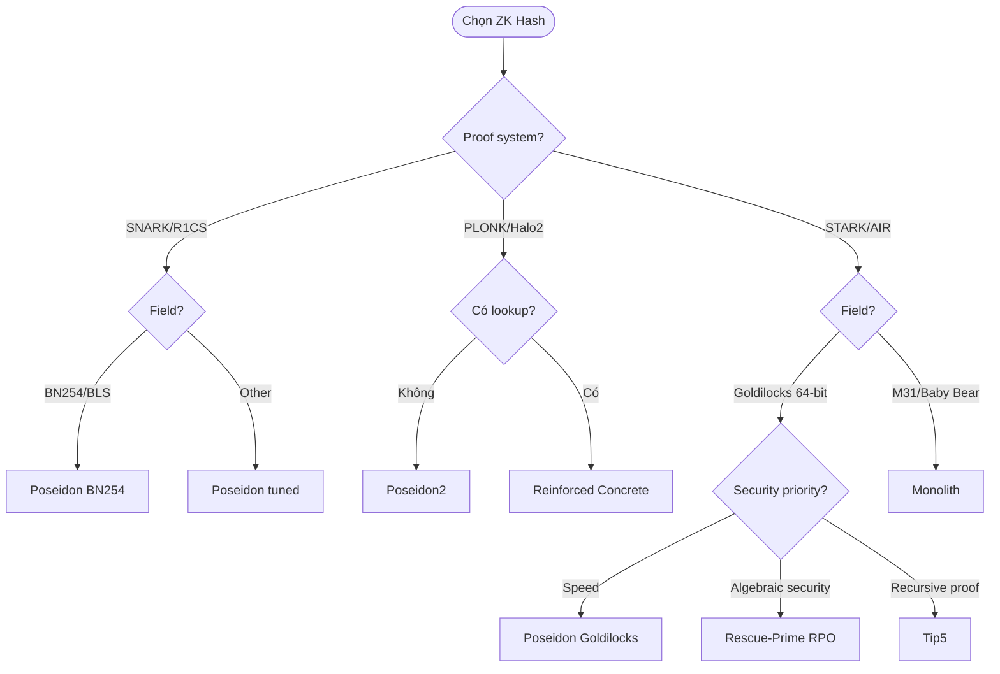

> **Prerequisites**: [[05-poseidon-design|05. Poseidon]], [[07-rescue-rescue-prime|07. Rescue & Rescue-Prime]], [[02-zk-proof-systems-circuits|02. ZK Proof Systems]]
> **Objectives**:
> - Hiểu động lực ra đời của các hash functions thế hệ mới (2022–2024)
> - Nắm Flystel construction và tại sao Anemoi hiệu quả hơn Poseidon trong nhiều settings
> - Hiểu Griffin's non-uniform nonlinearity
> - Biết lookup-friendly design và Reinforced Concrete
> - So sánh tổng thể tất cả hash functions để chọn đúng cho từng use case

---

## Motivation: Tại sao cần thêm hash functions?

Đến 2022, cộng đồng ZK đã có Poseidon (SNARK), Rescue-Prime (STARK). Tại sao lại cần thêm?

Có ba động lực chính:

1. **Prover performance mới**: Các proof systems hiện đại (Plonkish, lookup arguments) có cost model khác — cần hash tối ưu riêng
2. **Security concerns**: Một số algebraic attacks mới xuất hiện, đặt dấu hỏi về security margin của Poseidon và Rescue
3. **New field**: Goldilocks, M31 (Mersenne-31), Baby Bear — cần hash tối ưu cho từng field

---

## Anemoi — Flystel Construction

Anemoi (Bouvier, Canteaut et al., 2022) dùng **Flystel construction** — khác với SPN và Feistel truyền thống.

### Flystel: Ý tưởng cốt lõi

> [!definition] Definition 8.1 — Flystel Construction
> **Flystel** là S-box hoạt động trên **cặp** field elements $(x, y)$ và map thành $(u, v)$:
>
> $$u = x - Q_\gamma(y)$$
> $$v = y - Q_\delta(u)$$
> $$u \leftarrow u + Q_\beta(v)$$
>
> trong đó $Q_\gamma, Q_\delta, Q_\beta$ là các **quadratic maps** (hàm bậc hai):
> $$Q_c(x) = c \cdot x^2 \quad \text{hoặc} \quad Q_c(x) = c \cdot x^{1/\alpha}$$
>
> Flystel kết hợp ưu điểm của Feistel (invertibility, hiệu quả) với SPN (diffusion tốt).

**Tính chất quan trọng**: Flystel là **CCZ-equivalent** với cấu trúc được chứng minh là có differential/linear uniformity thấp. Đây là tính chất mật mã học chứng minh được — khác với MiMC hay Poseidon chỉ có heuristic security argument.

### Anemoi Round Function

Một round của Anemoi gồm:

1. **Linear layer (Flystel preprocessing)**: $\vec{x} \leftarrow M \cdot \vec{x}$
2. **Flystel S-box**: Áp dụng Flystel cho từng cặp $(x_i, y_i)$
3. **Constant addition**: $\vec{x} \leftarrow \vec{x} + \vec{C}_i$

```python
# Flystel S-box trong Python (simplified)
def flystel(x, y, beta, delta, gamma, alpha, p):
    """
    Flystel S-box trên (x, y) -> (u, v)
    alpha: exponent cho S-box phụ
    """
    # Step 1: u = x - gamma * y^2 (hoặc y^alpha tùy variant)
    u = (x - gamma * pow(y, 2, p)) % p  # H variant: dùng y^2

    # Step 2: v = y - delta * u^alpha (inverse S-box)
    v = (y - delta * pow(u, alpha, p)) % p  # Open variant

    # Step 3: u = u + beta * v^2
    u = (u + beta * pow(v, 2, p)) % p

    return u, v

# Ví dụ demo
p = 101  # prime nhỏ để demo
beta, delta, gamma = 2, 3, 5
alpha = 3

x, y = 7, 11
u, v = flystel(x, y, beta, delta, gamma, alpha, p)
print(f"Flystel({x}, {y}) = ({u}, {v})")
```

### So sánh Anemoi vs Poseidon (PLONK)

| | Poseidon (t=4) | Anemoi (t=4) |
|--|---------------|-------------|
| Multiplication per perm | ~540 | ~180 |
| PLONK rows per perm | ~189 | ~72 |
| Speedup | 1x | ~2.6x |
| Security argument | Heuristic (HADES) | Partial formal (CCZ) |

---

## Griffin — Non-Uniform Nonlinearity

Griffin (Grassi et al., 2022) là hash function với **nonlinear layer không đồng nhất** — khác với Poseidon (tất cả S-boxes giống nhau) và Rescue (hai loại S-boxes luân phiên).

> [!definition] Definition 8.2 — Griffin Nonlinear Layer
> Griffin dùng nonlinear layer với **3 loại operations khác nhau** trong cùng một layer:
>
> - **Element 0**: $x \leftarrow x^\alpha$ (power map — như Poseidon)
> - **Element 1**: $x \leftarrow x^{1/\alpha}$ (inverse power map — như Rescue)
> - **Elements 2 đến t-1**: $x_i \leftarrow x_i \cdot (a_i x_0^2 + b_i x_0 + c_i)$ (nhân với quadratic)
>
> Ba loại operations này kết hợp cho security cao hơn với ít rounds hơn.

**Tại sao Griffin nhanh hơn?**

Elements 2..t-1 dùng multiplication với đa thức bậc 2 của $x_0$ (không phải power map bậc cao). Trong R1CS, điều này chỉ cần 2–3 constraints thay vì 3 constraints cho $x^5$.

Kết quả: **Griffin là hash function nhanh nhất** trong SNARKs theo prover time (tháng 12/2025), dù chưa có đủ thời gian để được kiểm chứng security.

---

## Reinforced Concrete — Lookup-Friendly Design

Reinforced Concrete (Grassi et al., 2022) khai thác khả năng **lookup arguments** của các proof systems hiện đại (UltraPlonk, Halo2 với lookup).

> [!definition] Definition 8.3 — Lookup Argument
> **Lookup argument** cho phép circuit "kiểm tra rằng $x$ nằm trong bảng $T$" với chi phí $O(1)$ constraints, thay vì encode điều kiện đó bằng polynomial constraints.
>
> Ví dụ: Chứng minh $x \in [0, 255]$ (8-bit range check):
> - Không có lookup: ~8 constraints (bit decomposition)
> - Với lookup (bảng 256 entries): 1 constraint

**Ý tưởng của Reinforced Concrete**: Thay S-box bằng các functions có thể được biểu diễn hiệu quả bằng lookup tables:

- **Bars**: Lookup function biểu diễn một nonlinear permutation bằng bảng
- **Bricks**: Simple quadratic functions trên subfields

```
Reinforced Concrete round:
[Concrete (linear)] → [Bars (lookup)] → [Bricks (quadratic)]
```

**Hiệu quả**: Với UltraPlonk + lookup arguments, Reinforced Concrete có thể nhanh hơn Poseidon 2–3x trên large prime fields.

**Hạn chế**: Chỉ hiệu quả khi proof system hỗ trợ lookup arguments. Nếu dùng R1CS thuần, không có lợi thế.

---

## Neptune / Tip5 — STARK với Lookup

Neptune và Tip5 (Szepieniec et al., 2023) dùng lookup tables đặc biệt cho STARK proof systems với Goldilocks field.

> [!definition] Definition 8.4 — Tip5 S-box (Split-and-Lookup)
> Tip5 dùng **split-and-lookup S-box**: Chia field element $x \in \mathbb{F}_p$ (64-bit Goldilocks) thành **các chunk nhỏ hơn** (16-bit), áp dụng nonlinear function bằng lookup table cho từng chunk, sau đó recombine.
>
> Cụ thể: Split $x$ thành 4 chunks 16-bit, áp dụng $S: \mathbb{F}_{2^{16}} \to \mathbb{F}_{2^{16}}$ cho mỗi chunk (dùng AES S-box variant), recombine.

**Đặc tính quan trọng của Tip5**:
- Chống **algebraic attacks** tốt hơn Poseidon (S-box không phải monomial)
- Hiệu quả với **STARK recursive proofs** (Triton VM)
- Không hiệu quả cho SNARKs (lookup tables đắt trong R1CS)

---

## Monolith — Small Field Optimization

Monolith (Grassi et al., 2023) tối ưu cho **Mersenne-31** ($p = 2^{31} - 1$) và **BabyBear** ($p = 2^{31} - 2^{27} + 1$) — các fields nhỏ dùng trong zkVMs hiện đại.

**Tại sao small fields quan trọng?** zkVMs như Polygon Valida, Risc Zero, và SP1 dùng Mersenne-31 hoặc BabyBear vì arithmetic trên 32-bit là **native** với CPU hiện đại (không cần big-number arithmetic). Cần hash function tối ưu cho các fields này.

---

## So sánh Tổng Thể Tất Cả Hash Functions



**Bảng so sánh đầy đủ** (tham khảo thêm tại [[a0-hash-comparison-table|A0. Hash Function Comparison Table]] *(appendix — chưa tạo)*)):

| Hash | Năm | Best for | R1CS (t=3) | PLONK | Algebraic security | Battle-tested |
|------|-----|----------|-----------|-------|--------------------|---------------|
| MiMC-7 | 2016 | Legacy SNARK | ~644 | Medium | Medium | Cao |
| Poseidon | 2019 | SNARK (BN254) | ~240 | Good | Medium | Rất cao |
| Rescue-Prime | 2020 | STARK | ~1200 | Poor | Cao | Cao |
| Poseidon2 | 2023 | PLONK/Halo2 | ~220 | Excellent | Medium | Medium |
| Griffin | 2022 | SNARK (speed) | ~180 | Excellent | Thấp hơn | Thấp |
| Anemoi | 2022 | PLONK | ~200 | Very Good | Medium-High | Thấp |
| RC | 2022 | PLONK + lookup | N/A | Best | Medium | Thấp |
| Tip5 | 2023 | STARK recursive | N/A | N/A | High | Thấp |
| Monolith | 2023 | Small fields | N/A | N/A | Medium-High | Thấp |

> [!warning] Warning 8.5 — Trap của "Hash Mới Nhất = Tốt Nhất"
> Các hash functions sau 2022 thường chưa được kiểm chứng đủ. Trong mật mã học, **time under scrutiny** là metric quan trọng:
> - Poseidon (2019): 6+ năm, nhiều papers phân tích, nhiều audits
> - Griffin/Anemoi (2022): 3 năm, ít audits hơn
> - Monolith/Tip5 (2023): 2 năm, chưa đủ scrutiny
>
> Cho production systems xử lý giá trị lớn: **chọn Poseidon hoặc Rescue-Prime**.
> Cho research/experimental: có thể test các designs mới.

---

## Security Issues Đã Phát Hiện

### Poseidon — "First Two Rounds Bypass"

Được phát hiện 2022 (và được fix trong Poseidon2): Algebraic attacker có thể treat 2 rounds đầu như preprocessing — reduce effective rounds từ $R_F + R_P$ xuống $R_F + R_P - 2$.

Poseidon2 fix bằng cách thêm $M_E$ matrix trước round đầu tiên.

### Griffin — Algebraic Distinguisher (2023)

> [!danger] Danger 8.6 — Griffin Algebraic Distinguisher
> Bariant et al. (eprint.iacr.org/2024/347) phát hiện **algebraic distinguisher** có thể áp dụng cho Griffin với một số tham số. Attack không phải collision/preimage, nhưng cho thấy security margin không đủ lớn.
>
> **Lesson**: Griffin hiệu quả nhất nhưng cũng dễ bị phát hiện weakness nhất trong số các hash mới. Chưa nên dùng trong production.

### Anemoi — Tương đối an toàn (đến nay)

Không có công khai break nào với tham số recommend (đến Q1 2026). Nhưng chỉ có 3 năm scrutiny.

---

## Summary / Key Takeaways

- **Anemoi** (Flystel): CCZ-equivalent security argument, ~2.5x nhanh hơn Poseidon trong PLONK; đủ mature để consider cho non-critical uses
- **Griffin**: Nhanh nhất trong R1CS nhưng có algebraic distinguisher risks — không recommend production
- **Reinforced Concrete**: Tối ưu cho PLONK + lookup arguments; cần proof system support
- **Tip5**: Cho STARK recursive proofs với Goldilocks; thay thế Rescue-Prime trong Triton VM
- **Monolith**: Cho M31/BabyBear field trong zkVMs hiện đại
- **Chọn hash**: Production → Poseidon/Rescue-Prime; Research/Experimental → Anemoi/Poseidon2; zkVM → Monolith/Tip5

---

## References

- Bouvier et al. — *Anemoi: Exploiting the Link between Arithmetization-Orientation and CCZ-Equivalence* (eprint.iacr.org/2022/840)
- Grassi et al. — *Griffin: Toward Actionable Efficiency-Security Tradeoffs for Symmetric Primitives* (eprint.iacr.org/2022/403)
- Grassi et al. — *Reinforced Concrete: A Fast Hash Function for Verifiable Computation* (eprint.iacr.org/2021/1038)
- Szepieniec et al. — *The Tip5 Hash Function for Recursive STARKs* (eprint.iacr.org/2023/107)
- Grassi et al. — *Monolith: Circuit-Friendly Hash Functions with New Nonlinear Layers* (eprint.iacr.org/2023/1025)
- Bariant et al. — *The Algebraic Freelunch: Efficient Gröbner Basis Attacks Against Arithmetization-Oriented Primitives* (eprint.iacr.org/2024/347)
- TACEO Blog — *Which ZK Hash Should You Use?* (core.taceo.io, Dec 2025)
