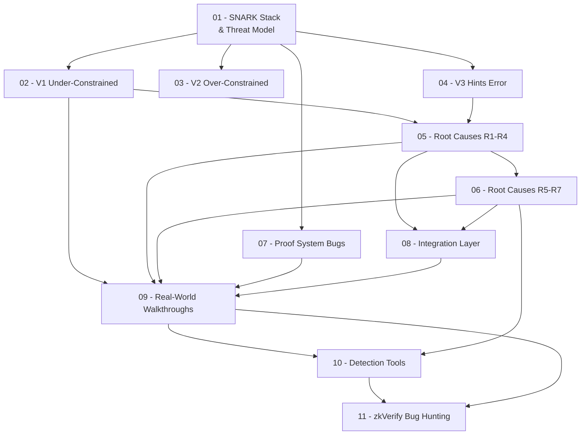

> **Topic**: ZK Vulnerability Classes — Full Taxonomy (SoK USENIX 2024)  
> **Domain**: ZK Security / Cryptography  
> **Level**: Intermediate → Advanced (Bug Bounty focused)  
> **Background**: Circom cơ bản, hiểu R1CS, viết được circuit đơn giản  
> **Tools / Code**: Circom, Halo2/Rust (eDSL), Python (PoC exploit)  
> **Sources**: SoK USENIX 2024 (Chaliasos et al.), 0xPARC zk-bug-tracker, zksecurity/zkbugs, Trail of Bits, Veridise

---

## Lessons

| # | Title | Key Concepts | Prerequisites | Difficulty |
|---|-------|-------------|---------------|------------|
| 01 | SNARK Stack & Threat Model | SNARK layers, R1CS, Plonkish, witness vs constraint, soundness, adversary model | Circom cơ bản | ★★☆☆☆ |
| 02 | V1: Under-Constrained | Soundness breakdown, 6 sub-types, 96% bug share, real PoC | 01 | ★★★☆☆ |
| 03 | V2: Over-Constrained | Completeness breakdown, dư constraint, khi nào nguy hiểm | 01 | ★★★☆☆ |
| 04 | V3: Computational & Hints Error | `<--` vs `<==`, witness gen error, hint mismatch | 01, 02 | ★★★☆☆ |
| 05 | Root Causes R1–R4 | Assigned-not-Constrained, Missing Input, Unsafe Reuse, Unconstrained Output | 02, 04 | ★★★★☆ |
| 06 | Root Causes R5–R7 | Custom Gates (Halo2), Out-of-Circuit, Arithmetic Field / Alias Bug | 05 | ★★★★☆ |
| 07 | Proof System Layer Bugs | Frozen Heart, Gnark Groth16, trusted setup, backend soundness | 01 | ★★★★☆ |
| 08 | Integration Layer Bugs | Nullifier reuse, missing on-chain validation, cross-layer bugs | 01–06 | ★★★☆☆ |
| 09 | Real-World Bug Walkthroughs | 6 bug có PoC: circom-pairing, zkSync, PSE Scroll, ZK Email | 01–06 | ★★★★☆ |
| 10 | Detection Tools & Audit Methodology | circomspect, ZKAP, zkFuzz, formal verification, audit checklist | 01–08 | ★★★★☆ |
| 11 | zkVerify Bug Hunting | Attack surface map, mapping taxonomy → Immunefi scope, hunting strategy | 01–10 | ★★★★★ |

## Appendix Candidates

| ID | Content | Related Lessons | Notes |
|----|---------|-----------------|-------|
| A0 | Bug Reference Sheet | 02–08 | Tất cả patterns + fix, code snippet Circom/Halo2 |
| A1 | Tools Cheatsheet | 10 | Lệnh cụ thể circomspect, snarkjs, zkFuzz |

---

## Dependency Graph

---

## Progress Tracker

- [ ] [[00-roadmap|00. Roadmap]]
- [ ] [[01-snark-stack-and-threat-model|01. SNARK Stack & Threat Model]]
- [ ] [[02-v1-under-constrained|02. V1: Under-Constrained]]
- [ ] [[03-v2-over-constrained|03. V2: Over-Constrained]]
- [ ] [[04-v3-computational-hints-error|04. V3: Computational & Hints Error]]
- [ ] [[05-root-causes-r1-r4|05. Root Causes R1–R4]]
- [ ] [[06-root-causes-r5-r7|06. Root Causes R5–R7]]
- [ ] [[07-proof-system-layer-bugs|07. Proof System Layer Bugs]]
- [ ] [[08-integration-layer-bugs|08. Integration Layer Bugs]]
- [ ] [[09-real-world-bug-analysis|09. Real-World Bug Walkthroughs]]
- [ ] [[10-detection-tools-and-methodology|10. Detection Tools & Audit Methodology]]
- [ ] [[11-zkverify-bug-hunting|11. zkVerify Attack Surface & Bug Bounty]]
- [ ] [[a0-bug-reference-sheet|A0. Bug Reference Sheet]]
- [ ] [[a1-tools-cheatsheet|A1. Tools Cheatsheet]]
