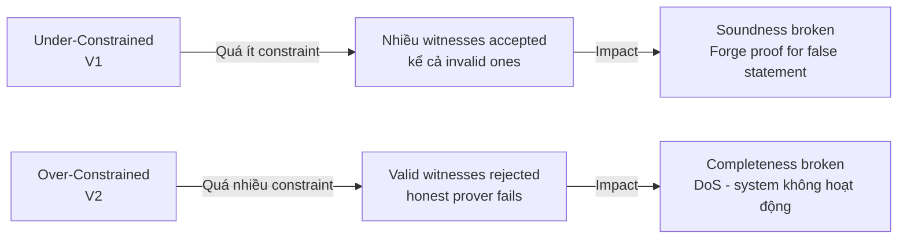

> **Prerequisites**: [[01-snark-stack-and-threat-model|01. SNARK Stack & Threat Model]], [[02-v1-under-constrained|02. V1: Under-Constrained]]  
> **Objectives**:
> - Hiểu over-constrained circuit là gì và tại sao nó vi phạm completeness
> - Phân biệt rõ V2 với V1 — cùng nguồn gốc nhưng tác hại ngược chiều
> - Nhận biết các patterns gây over-constrained trong Circom và Halo2
> - Biết khi nào V2 trở nên nguy hiểm hơn DoS đơn thuần

---

## Motivation

V1 Under-Constrained cho phép prover gian lận. V2 Over-Constrained thì ngược lại: **prover trung thực không thể tạo proof dù biết witness đúng**. Thoạt nghe có vẻ ít nguy hiểm hơn — không mất tiền trực tiếp. Nhưng trong một ZK-rollup:

- Nếu circuit over-constrained với một số transaction type → các giao dịch đó không thể được sequenced
- Trong ZK-bridge → bridge bị freeze
- Trong ZK-VM → toàn bộ VM không thể execute một số opcode

V2 là bug ít phổ biến hơn (~4 bugs trong SoK paper so với ~95 bugs V1), nhưng impact có thể nghiêm trọng tùy context.

---

## 1. Định nghĩa Chính thức

> [!definition] Definition 3.1 — Over-Constrained Circuit
> Một circuit $\mathcal{C}$ bị **over-constrained** nếu constraint system $\mathcal{S}$ reject một số witnesses hợp lệ — tức là tồn tại witness $\vec{w}$ thỏa mãn *ý định logic* của circuit nhưng không thỏa mãn constraint system:
>
> $$\exists \vec{w} : \text{Logically valid}(\vec{w}) = \text{true} \wedge \mathcal{S}(\vec{w}) = \text{unsat}$$

> [!warning] Impact — Completeness Broken
> Over-constrained circuit vi phạm **completeness**: honest prover biết witness đúng nhưng không tạo được proof.
> Hệ quả chính: **Denial of Service (DoS)** — một phần hoặc toàn bộ system không hoạt động được.

---

## 2. Phân biệt V1 vs V2



Quan trọng: cả hai đều xuất phát từ **sự không khớp giữa ý định logic và constraint system**, chỉ khác hướng lệch.

---

## 3. Các Nguyên nhân Gây Over-Constrained

### Pattern 3.1 — Extra Constraint Không Cần Thiết

Developer thêm constraint dư để "cho chắc", nhưng constraint đó lại loại bỏ các witnesses hợp lệ.

**Ví dụ:**

```circom
pragma circom 2.0.0;

template AbsoluteValue() {
    signal input x;   // có thể âm hoặc dương
    signal output y;  // |x|

    // Tính absolute value:
    y <-- x >= 0 ? x : -x;

    // CONSTRAINT HỢP LỆ: y^2 = x^2
    y * y === x * x;

    // EXTRA CONSTRAINT SAI: thêm "y >= 0" (không express được trực tiếp trong R1CS)
    // Developer cố thêm: y === x  ← constraint này sai với input âm!
    // y === x;  // BUG: reject mọi input âm hợp lệ
}
```

Nếu thêm `y === x` như là constraint bổ sung, với input `x = -5`: witness `y = 5` (đúng) sẽ FAIL constraint `y === x` → circuit reject valid input.

---

### Pattern 3.2 — Strict Equality Thay vì Equivalence

Constraint đòi hỏi giá trị *cụ thể* thay vì *thuộc tính cần thiết*.

**Ví dụ:**

```circom
template CheckBit() {
    signal input b;
    
    // Ý định: b phải là bit (0 hoặc 1)
    // Constraint đúng:
    b * (b - 1) === 0;  // b=0 hoặc b=1 đều ok
    
    // Constraint SAI (over-constrained):
    // b === 1;  // Reject tất cả input b=0 hợp lệ!
}
```

---

### Pattern 3.3 — Alias Check Sai trong Bit Decomposition

Khi dùng `Num2Bits` với alias check, một số giá trị hợp lệ có thể bị reject nếu check quá strict.

**Ví dụ — Field prime boundary:**

```circom
// p = 21888242871839275222246405745257275088548364400416034343698204186575808495617
// (BN254 scalar field prime, ~254 bits)

template Num2BitsStrict254() {
    signal input in;
    signal output out[254];
    
    component n2b = Num2Bits(254);
    n2b.in <== in;
    
    // AliasCheck đảm bảo in < p
    component ac = AliasCheck();
    // ... connect ac
    
    // BUG (potential): Nếu AliasCheck implement sai,
    // có thể reject giá trị hợp lệ gần p hoặc accept giá trị > p
}
```

Implement AliasCheck sai theo hướng "quá strict" → reject giá trị hợp lệ $\leq p-1$ → over-constrained.

---

### Pattern 3.4 — Incorrect Custom Gate Offsets (Halo2)

Trong Halo2 (Plonkish arithmetization), custom gates apply trên **rows**. Nếu gate offset sai, gate có thể apply vào sai row và tạo constraint vô nghĩa — reject valid witnesses.

**Ví dụ Halo2 (Rust):**

```rust
// Halo2 gate definition
meta.create_gate("add gate", |meta| {
    let a = meta.query_advice(col_a, Rotation::cur());
    let b = meta.query_advice(col_b, Rotation::cur());
    let c = meta.query_advice(col_c, Rotation::cur());
    
    // INTENDED: a + b = c at current row
    // Constraint: a + b - c = 0
    vec![a + b - c]
    
    // BUG (if wrong offset):
    // let c_next = meta.query_advice(col_c, Rotation::next()); // sai row!
    // Tạo constraint vô nghĩa giữa current row và next row
});
```

Với offset sai, constraint apply vào cặp rows không liên quan → nhiều valid assignments bị reject → over-constrained.

---

### Pattern 3.5 — Conditional Constraint Apply Sai

Constraint chỉ nên áp dụng trong một số trường hợp (conditional), nhưng được apply toàn cục.

**Ví dụ:**

```circom
template ConditionalCheck() {
    signal input flag;  // 0 hoặc 1
    signal input x;
    signal input y;
    
    // Ý định: nếu flag=1 thì x === y, nếu flag=0 thì không cần
    
    // CÁCH SAI (over-constrained):
    x === y;  // Luôn enforce x=y, bỏ qua flag!
    
    // CÁCH ĐÚNG:
    // flag * (x - y) === 0;  // Chỉ enforce khi flag=1
}
```

---

## 4. Khi nào V2 Nguy hiểm Hơn DoS?

Trong một số scenario, over-constrained có thể gây ra hậu quả ngoài DoS thuần túy:

**Scenario 1 — Selective DoS (Censorship)**

Nếu circuit over-constrained chỉ với một *tập con* inputs, attacker có thể craft inputs thuộc tập bị reject để censor giao dịch cụ thể trong ZK-rollup.

**Scenario 2 — Economic Damage**

Trong ZK-bridge: nếu withdrawal circuit bị over-constrained, users không thể rút tiền → tiền bị lock vĩnh viễn.

**Scenario 3 — Privacy Leak qua Timing**

Nếu circuit over-constrained chỉ với một số private inputs, việc proof generation fail có thể leak thông tin về private input (timing side-channel).

---

## 5. Ví dụ Thực tế — Zendoo Missing Normalization

Bug thực tế từ 0xPARC bug tracker:

> **Zendoo: Missing Polynomial Normalization after Arithmetic Operations**

Trong circuit của Zendoo (Horizen's cross-chain protocol), sau một số phép toán trên polynomials, kết quả không được normalize về dạng chuẩn. Một số valid inputs sau normalize cho cùng kết quả, nhưng các constraint so sánh trực tiếp dạng chưa normalize → reject witnesses hợp lệ.

**Bài học:** Khi làm việc với biểu diễn trung gian (intermediate representation), cần đảm bảo constraints check *thuộc tính cần thiết*, không check *dạng biểu diễn cụ thể*.

---

## 6. Detection — Nhận biết Over-Constrained

Không như V1 (cần exploit để confirm), V2 thường phát hiện được qua **testing**:

```python
# test_over_constrained.py
# Chiến lược: fuzz valid inputs và check xem proof generation có fail không

from py_ecc.bn128 import field_modulus

def test_circuit_with_valid_inputs(circuit_witness_fn, circuit_prove_fn):
    """
    Fuzz test: nếu circuit reject valid input → over-constrained
    """
    test_cases = [
        {"x": 0},
        {"x": 1},
        {"x": -1},          # = field_modulus - 1 trong Fp
        {"x": field_modulus - 1},
        {"x": 2**127},      # edge case: giá trị lớn
        {"x": 2**253},      # gần boundary của 254-bit field
    ]
    
    for case in test_cases:
        try:
            witness = circuit_witness_fn(case)
            proof = circuit_prove_fn(witness)
            print(f"✅ Input {case} → proof OK")
        except Exception as e:
            print(f"❌ Input {case} → PROOF FAIL: {e}")
            print(f"   → Possible over-constrained for this input class!")
```

**Tool tự động:** zkFuzz (xem Lesson 10) có thể fuzz tự động để tìm valid inputs bị reject.

---

## Summary / Key Takeaways

- **V2 Over-Constrained** = circuit có quá nhiều constraints → valid witnesses bị reject → completeness broken.
- Impact chủ yếu là **DoS**, nhưng có thể nghiêm trọng hơn trong ZK-bridge, ZK-rollup (fund lock, censorship).
- Các nguyên nhân: extra constraint thừa, strict equality sai, alias check sai, custom gate offset sai (Halo2), conditional constraint apply toàn cục.
- **Phát hiện qua testing**: fuzz valid inputs và check xem proof generation có fail không.
- V2 ít phổ biến hơn V1 (~4 vs ~95 bugs) nhưng không nên bỏ qua khi audit.
- Root cause R5 (Incorrect Custom Gates) và R7 (Arithmetic Field Error) thường liên quan đến V2.

---

## References

- Chaliasos et al. — *SoK USENIX 2024*, Section 5 (V2 taxonomy)
- 0xPARC ZK Bug Tracker — Zendoo bug
- zkFuzz paper — *ZKFUZZ: Foundation and Framework* — [arxiv.org/abs/2504.11961](https://arxiv.org/abs/2504.11961)
- Halo2 Book — Custom Gates — [zcash.github.io/halo2](https://zcash.github.io/halo2/concepts/arithmetization.html)
