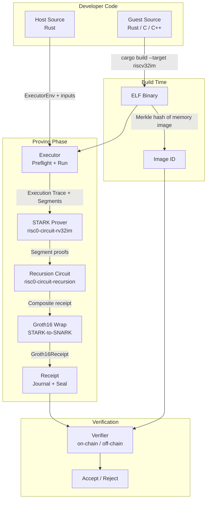
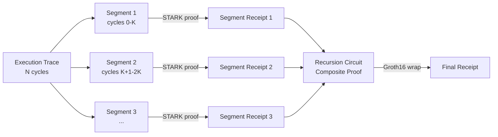
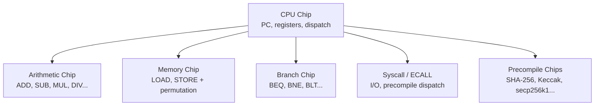
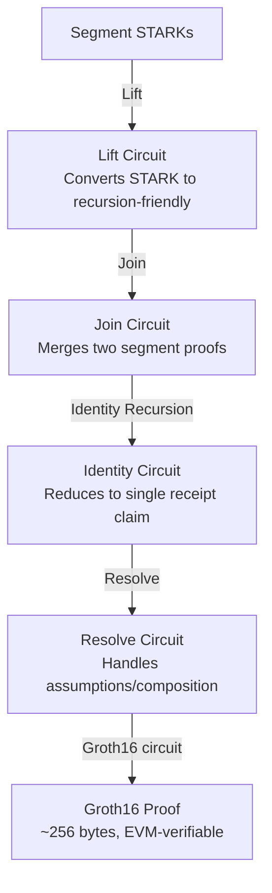

> **Prerequisites**: [[03-zkvm-architecture-overview|03. zkVM Architecture Overview]]
> **Objectives**:
> - Hiểu kiến trúc chi tiết của Risc0: Executor, circuit rv32im, Zirgen DSL
> - Biết cấu trúc của Receipt (journal + seal), Image ID, continuations
> - Hiểu pipeline STARK → SNARK (Groth16) và ý nghĩa bảo mật của từng bước
> - Nắm hệ thống precompile và DEV_MODE — hai nguồn bug quan trọng trong Risc0

---

## Motivation

Risc0 là một trong những zkVM đầu tiên và được kiểm tra bảo mật nhiều nhất. Với 96 person-weeks audit từ Veridise (2024–2025), nhiều CVE đã được tìm thấy trong Risc0. Hiểu sâu kiến trúc Risc0 giúp ta:

1. Biết **chính xác** chỗ nào trong codebase có thể chứa bug
2. Đọc hiểu audit reports và CVE advisories
3. Submit bug bounty có giá trị trên HackenProof

---

## Tổng quan kiến trúc Risc0



---

## Host và Guest: Cấu trúc project

Mỗi Risc0 project gồm hai crate chính:

```text
my-project/
├── host/               ← Rust code chạy bên ngoài zkVM
│   └── src/main.rs
├── methods/
│   ├── guest/          ← Rust code chạy BÊN TRONG zkVM
│   │   └── src/main.rs
│   └── build.rs        ← Sinh IMAGE_ID, link ELF vào host
└── Cargo.toml
```

**Guest** — ví dụ điển hình:

```rust
// methods/guest/src/main.rs
use risc0_zkvm::guest::env;

fn main() {
    // Đọc private input từ host (không xuất hiện trong proof)
    let input: u64 = env::read();

    // Tính toán
    let result = input * input;

    // Commit public output vào journal (xuất hiện trong receipt)
    env::commit(&result);
}
```

**Host** — điều phối proving:

```rust
// host/src/main.rs
use risc0_zkvm::{default_prover, ExecutorEnv};
use methods::{GUEST_ELF, GUEST_ID};  // GUEST_ID = Image ID

fn main() {
    let input: u64 = 42;

    let env = ExecutorEnv::builder()
        .write(&input).unwrap()
        .build().unwrap();

    // Prove execution
    let prover = default_prover();
    let receipt = prover.prove(env, GUEST_ELF).unwrap();

    // Verify locally
    receipt.verify(GUEST_ID).expect("Verification failed");

    // Đọc public output
    let result: u64 = receipt.journal.decode().unwrap();
    println!("Result: {}", result);  // 1764
}
```

> [!warning] Warning 4.1 — Host không được trust
> Host code có thể làm **bất cứ điều gì** — cung cấp input độc hại, đọc memory, ... Tuy nhiên, host **không thể làm thay đổi execution của guest mà proof vẫn hợp lệ**. Nếu host gian lận, proof sẽ fail.
>
> **Implication for security**: Logic nào cần được guarantee bởi proof phải nằm trong **guest**. Logic nằm trong host là "lời nói của prover" — không đáng tin.

---

## Image ID — Định danh của chương trình

Image ID là một trong những khái niệm quan trọng nhất trong Risc0:

> [!definition] Definition 4.2 — Image ID
> **Image ID** là hash Merkle của **memory image** ban đầu khi ELF binary được nạp vào zkVM.
>
> $$\text{ImageID} = \text{MerkleHash}(\text{initial\_memory\_state}(ELF))$$
>
> Chỉ các pages của ELF thực sự được load vào memory mới ảnh hưởng đến Image ID (debug info và timestamps bị bỏ qua).

Image ID đóng vai trò gì trong bảo mật?

- Verifier kiểm tra Image ID trong receipt → đảm bảo **đúng chương trình** đã chạy
- Image ID phải được verifier biết **trước** (không thể giả mạo bằng cách submit proof của chương trình khác)
- Trong smart contract, Image ID thường được hardcode hoặc registered on-chain

> [!danger] Danger 4.3 — Image ID Mismatch Attack
> Nếu verifier không kiểm tra Image ID đúng cách (hoặc accept bất kỳ Image ID nào), attacker có thể submit proof của một chương trình **khác** — ví dụ chương trình luôn commit kết quả mong muốn bất kể input.
>
> ```rust
> // BUG: Không kiểm tra image ID
> receipt.verify_integrity().unwrap();  // chỉ check proof format
>
> // CORRECT: Kiểm tra cả image ID
> receipt.verify(EXPECTED_IMAGE_ID).unwrap();
> ```

---

## Executor và Execution Trace

**Executor** là component chạy ELF binary và sinh execution trace. Trong Risc0, executor hoạt động theo 2 bước:

1. **Preflight** (Light pass): Chạy nhanh để xác định segments cần prove và gather metadata
2. **Execute** (Full pass): Chạy đầy đủ và ghi lại execution trace chi tiết

> [!definition] Definition 4.4 — Segment và Continuation
> Với chương trình lớn, Risc0 chia execution trace thành nhiều **segments** nhỏ hơn. Mỗi segment được prove độc lập, sau đó các segment proofs được kết hợp bằng **recursion circuit** thành một proof duy nhất.
>
> Cơ chế này gọi là **continuations** — cho phép prove chương trình không giới hạn kích thước mà không cần bộ nhớ vô hạn.



---

## Receipt: Journal + Seal

Receipt là output cuối cùng của quá trình proving:

> [!definition] Definition 4.5 — Receipt
> **Receipt** gồm hai phần:
> - **Journal**: Các giá trị public được guest commit (`env::commit()`). Bất kỳ ai cũng có thể đọc.
> - **Seal**: Blob cryptographic chứa ZK proof. Seal chứng minh journal được sinh ra bởi execution đúng của chương trình có Image ID tương ứng.

**Các loại receipt trong Risc0:**

| Loại | Mô tả | Kích thước |
|------|-------|------------|
| `CompositeReceipt` | STARK proofs cho nhiều segments, chưa compress | Lớn (~MB) |
| `SuccinctReceipt` | Đã qua recursion, một STARK proof | Trung bình |
| `Groth16Receipt` | STARK được wrap trong Groth16 SNARK | ~256 bytes |

> [!note] Note 4.6 — Lý do cần Groth16 Wrap
> STARK proof khá lớn (KB–MB) và tốn kém để verify on-chain. Risc0 dùng một Groth16 circuit để verify STARK proof → output là Groth16 proof nhỏ (~256 bytes) có thể verify on-chain với gas thấp.
>
> **Implication**: Trusted setup của Groth16 là một assumption bổ sung — Risc0 tổ chức public ceremony, nhưng nếu ceremony bị compromise, SNARK proof có thể bị forge.

---

## Zirgen DSL — Circuit Description

Risc0 dùng một DSL (Domain-Specific Language) tên **Zirgen** để mô tả circuit rv32im:

> [!definition] Definition 4.7 — Zirgen DSL
> **Zirgen** là ngôn ngữ mô tả circuit của Risc0, compile thành AIR constraints. Circuit rv32im trong Risc0 được viết hoàn toàn bằng Zirgen.
>
> Zirgen cho phép định nghĩa:
> - **Registers** và kiểu dữ liệu (bit, byte, u32, ...)
> - **Constraints** (mệnh đề phải thỏa mãn)
> - **Components** (có thể tái sử dụng — giống struct trong Rust)
> - **Lookups** (tra cứu bảng)

Ví dụ đơn giản về kiểu dữ liệu trong Zirgen:

```text
// Zirgen — định nghĩa 1 bit
component NondetBitReg() {
    reg: Reg;            // register lưu giá trị
    reg * (reg - 1) = 0; // constraint: reg phải là 0 hoặc 1
}

// Zirgen — định nghĩa 2-bit (0..3)
component NondetTwitReg() {
    reg: Reg;
    // BUG: chỉ constraint reg trong [0,3), không đủ ketat
    // nếu cần reg ∈ {0,1} thì phải dùng NondetBitReg
}
```

> [!danger] Danger 4.8 — Bug thực tế trong Zirgen: ExpandU32 (Veridise 2024)
> Trong component `ExpandU32` (decode u32 thành bytes), một field `_rd_0` được khai báo là `NondetTwitReg` (cho phép giá trị 0, 1, 2, 3) thay vì `NondetBitReg` (chỉ 0 hoặc 1).
>
> Kết quả: Một encoded instruction có thể có **nhiều interpretation hợp lệ**. Attacker có thể sinh ra hai proof khác nhau cho cùng một ELF binary — breaking uniqueness.
>
> **Fix**: Đổi `NondetTwitReg` → `NondetBitReg` cho field đó.

---

## Circuit rv32im — Cấu trúc

Circuit rv32im là trung tâm của Risc0. Nó mô tả từng RISC-V instruction phải được thực thi như thế nào dưới dạng polynomial constraints:



Mỗi instruction có một tập constraints riêng. Ví dụ, với instruction `ADD rd, rs1, rs2`:
- `rd ← rs1 + rs2` phải đúng (constraint số học)
- `rd`, `rs1`, `rs2` phải là valid register indices (constraint range)
- Hai register sources phải **phân biệt nhau** nếu instruction yêu cầu

> [!danger] Danger 4.9 — CVE-2025-52484: Thiếu constraint phân biệt rs1 và rs2
> **Root cause**: Trong circuit 3-register instruction, thiếu constraint đảm bảo `rs1` và `rs2` được decode từ đúng bits của instruction word.
>
> **Attack**: Prover có thể đặt `rs1 = rs2` khi thực thi, dù instruction mã hóa hai register khác nhau. VM sẽ "nhầm" hai register.
>
> **Impact**: Bất kỳ 3-register instruction nào (bao gồm `remu`, `divu`) trong Risc0 v2.0.x đều bị ảnh hưởng. Prover có thể produce computation sai mà proof vẫn verify.
>
> **Severity**: Critical. Fixed trong v2.1.0.

---

## Precompiles — Tăng tốc + Attack Surface

Precompile là custom circuit được tích hợp vào zkVM để tăng tốc các phép tính nặng. Thay vì prove hàng nghìn RISC-V instructions, precompile prove toàn bộ phép tính bằng một circuit chuyên biệt.

**Danh sách precompiles của Risc0:**

| Precompile | Chức năng | Syscall |
|-----------|-----------|---------|
| SHA-256 | Hash function | `sys_sha_compress` |
| Keccak-256 | Hash function (EVM) | `sys_keccak` |
| secp256k1 | ECDSA verify, point multiply | `sys_secp256k1_*` |
| Poseidon2 | ZK-friendly hash | Internal |
| RSA | BigInt multiply | `sys_bigint` |
| ed25519 | Signature verify | `sys_ed25519_*` |

> [!danger] Danger 4.10 — Precompile Circuit Bugs
> Mỗi precompile phải có circuit riêng, và circuit đó cũng có thể bị underconstrained.
>
> Trong audit 2024 của Veridise, hai lỗi **medium-severity underconstrained** được tìm thấy trong Poseidon2 external call circuit (V-RISC0-VUL-006, V-RISC0-VUL-007).
>
> **Principle**: Mỗi precompile là một attack surface mới. Số lượng precompile càng nhiều, audit surface càng lớn.

---

## DEV_MODE — Pitfall nguy hiểm nhất

> [!danger] Danger 4.11 — RISC0_DEV_MODE: Fake Receipt trong Production
> **Cơ chế**: Khi `RISC0_DEV_MODE=1`, Risc0 bỏ qua toàn bộ proof generation và tạo một **fake receipt** chứa execution output thực, nhưng seal là giả.
>
> **Mục đích**: Tăng tốc development — proving mất nhiều phút, fake receipt là tức thì.
>
> **Bug scenario**: Dev code vô tình deploy lên production với biến môi trường này được set (trong CI, Docker, ...)
>
> **Kết quả**: Bất kỳ computation nào cũng được "verify" — kể cả computation sai hoàn toàn. Attacker có thể submit bất kỳ output nào.

```rust
// Host code — vô tình an toàn nếu DEV_MODE tắt, NGUY HIỂM nếu DEV_MODE bật
receipt.verify(IMAGE_ID).unwrap(); // This PASSES even with fake receipt in dev mode!

// Risc0 v1.x+ có cơ chế bảo vệ: disable_dev_mode feature flag
// Cargo.toml:
// risc0-zkvm = { version = "...", features = ["disable-dev-mode"] }
```

> **Bug bounty relevance**: Kiểm tra bất kỳ production application nào dùng Risc0 có vô tình expose `RISC0_DEV_MODE` không — đặc biệt trong Docker configs, CI scripts, environment variables.

---

## STARK-to-SNARK Pipeline chi tiết



Mỗi bước trong pipeline này là một circuit riêng. **Mỗi circuit là một attack surface riêng**.

> [!note] Note 4.12 — Control Root và Version Control
> **Control root** là hash Merkle của tất cả recursion programs được phép dùng. Khi circuit RISC-V thay đổi (vd: fix bug), control root cập nhật.
>
> Risc0 dùng **Verifier Router** on-chain để manage các version của verifier. Khi phát hiện bug nghiêm trọng, version cũ bị disable qua **estop mechanism** — đây là cách Risc0 ứng phó CVE-2025-52484.

---

## Composition — Recursive Proof

Risc0 hỗ trợ **proof composition** (từ v0.20): guest có thể verify một receipt khác bên trong zkVM.

```rust
// Guest code — verify một receipt khác bên trong zkVM
use risc0_zkvm::guest::env;

fn main() {
    // Đọc một receipt từ host
    let inner_receipt: Receipt = env::read();

    // Verify receipt bên trong circuit — nếu fail, proof sẽ invalid
    env::verify(INNER_IMAGE_ID, &inner_receipt.journal).unwrap();

    // Tiếp tục logic...
}
```

> [!warning] Warning 4.13 — Assumption Resolution Bug
> Khi dùng composition, receipt kết quả chứa "assumptions" — danh sách các inner receipts chưa được verify đầy đủ. Nếu verifier không resolve tất cả assumptions, một computation sai có thể được accept nếu attacker cung cấp malicious inner receipt.
>
> Đây là một bug class riêng trong integration layer.

---

## Summary

- **Risc0 pipeline**: Guest ELF → Executor (preflight + run) → Segment STARKs → Recursion → Groth16 → Receipt.
- **Image ID** ràng buộc proof với chương trình cụ thể — verifier phải kiểm tra Image ID.
- **Receipt** = journal (public output) + seal (proof). Seal có thể là CompositeReceipt, SuccinctReceipt, hoặc Groth16Receipt.
- **Zirgen DSL** mô tả circuit rv32im — lỗi trong Zirgen code là nguồn chính của CVEs trong Risc0.
- **Precompiles** tăng tốc nhưng thêm attack surface — mỗi precompile cần circuit riêng và có thể bị underconstrained.
- **DEV_MODE** (`RISC0_DEV_MODE=1`) bypass proof hoàn toàn — nguy hiểm nếu vô tình dùng trong production.
- **Continuations** chia trace thành segments cho chương trình lớn.
- **STARK-to-SNARK** pipeline gồm nhiều recursion circuits — mỗi step là attack surface.

---

## References

- RISC Zero Docs — Overview of the zkVM: https://www.risczero.com/docs/explainers/zkvm/
- RISC Zero Docs — Receipts 101: https://dev.risczero.com/api/zkvm/receipts
- RISC Zero Docs — Key Terminology: https://dev.risczero.com/terminology
- RISC Zero FAQ: https://dev.risczero.com/faq
- Veridise — Risc0 ZK-VM Security Audit: https://veridise.com/blog/audit-insights/risc-zeros-zk-vm-security-how-veridise-enabled-risc-zero-to-achieve-provable-continuous-zk-security/
- GitHub Advisory CVE-2025-52484 (rs1/rs2 confusion): https://github.com/risc0/risc0/security/advisories/GHSA-g3qg-6746-3mg9
- GitHub Advisory GHSA-5xgj (ZK property): https://github.com/risc0/risc0/security/advisories/GHSA-5xgj-pmjj-gw49
- RISC Zero — Path to First Formally Verified RISC-V zkVM: https://risczero.com/blog/RISCZero-formally-verified-zkvm
