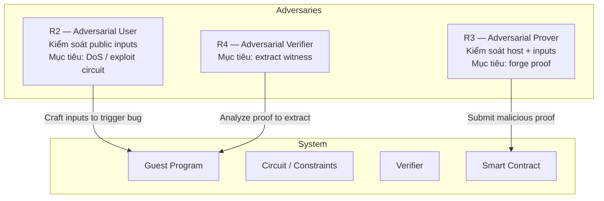
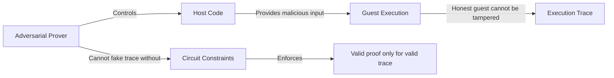
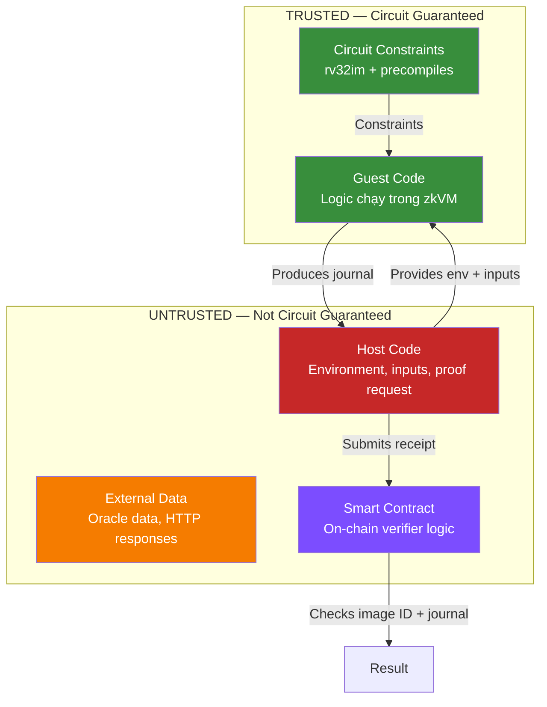
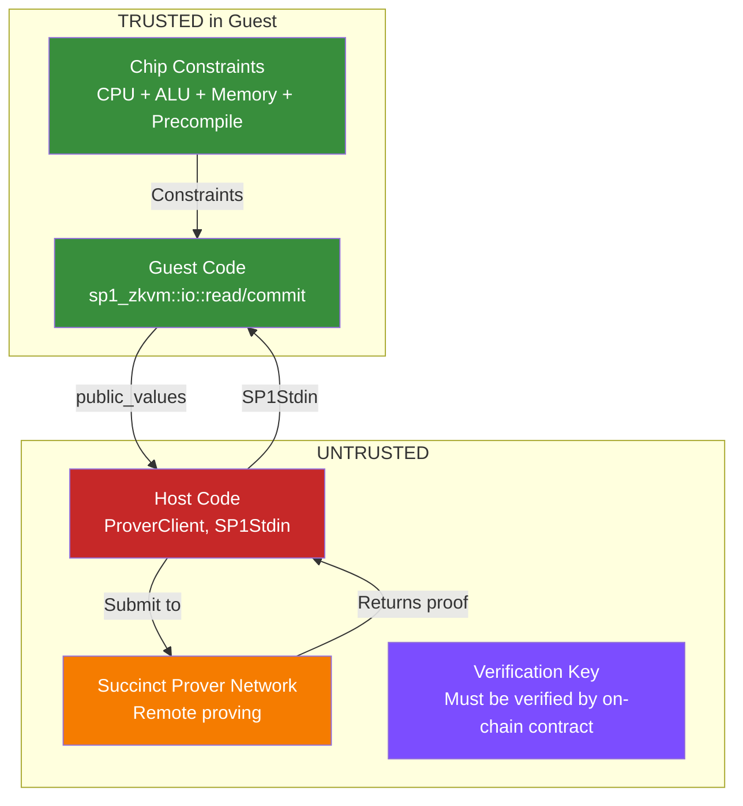

> **Prerequisites**: [[04-risc0-deep-dive|04. Risc0 Deep Dive]], [[05-sp1-deep-dive|05. SP1 Deep Dive]], [[06-zk-bug-taxonomy|06. ZK Bug Taxonomy]]
> **Objectives**:
> - Xác định đầy đủ các adversary trong hệ thống zkVM: adversarial prover, adversarial user, adversarial verifier
> - Map từng adversary với attack surface và class bug tương ứng
> - Hiểu trust boundary chi tiết trong Risc0 và SP1
> - Biết impact của từng loại attack — từ proof forgery đến DoS đến privacy leak
> - Áp dụng threat model để define scope khi làm bug bounty trên zkVerify

---

## Motivation

Một lỗi phổ biến khi audit ZK systems là **tập trung sai chỗ** — ví dụ chỉ review application code mà bỏ qua circuit, hoặc chỉ test với honest prover mà không thử malicious prover. Threat model chuẩn hóa việc phân tích bằng cách:

1. **Định nghĩa adversaries** — ai có thể tấn công, họ có quyền làm gì
2. **Định nghĩa assets** — cần bảo vệ cái gì
3. **Map attack surface** — mỗi component có thể bị tấn công như thế nào

---

## Các Adversary trong zkVM

USENIX'24 taxonomy định nghĩa 3 adversary chính:



---

## R2 — Adversarial User

> [!definition] Definition 7.1 — Adversarial User
> **Adversarial User** là người dùng hợp lệ của hệ thống (ví dụ: người submit transaction lên zkEVM) nhưng cố tình craft public inputs để khai thác lỗ hổng.
>
> **Khả năng**:
> - Submit **bất kỳ public input** nào cho prover
> - Thực hiện nhiều requests (oracle access tới prover)
> - Quan sát output (proof, public values)
>
> **Không có khả năng**:
> - Thay đổi guest program
> - Can thiệp vào circuit

**Attack scenarios của Adversarial User:**

**DoS qua circuit exhaustion**: Craft inputs khiến chương trình cần nhiều cycles vô lý (ví dụ: vòng lặp rất dài) → proving không kết thúc hoặc timeout.

**Trigger computational bug**: Craft inputs đặc biệt kích hoạt bug trong guest code hoặc executor.

```rust
// Guest code — BUG: không giới hạn độ dài input
let data: Vec<u8> = io::read_vec();
// data.len() không bounded → user submit 1GB data → OOM / timeout
for byte in &data {
    // ... processing
}
```

**Exploit underconstrained precompile**: Nếu một precompile circuit bị underconstrained, user có thể submit input đặc biệt khiến prover tạo invalid proof mà verifier accept.

---

## R3 — Adversarial Prover

Đây là adversary **nguy hiểm nhất** và là focus chính của ZK security.

> [!definition] Definition 7.2 — Adversarial Prover
> **Adversarial Prover** kiểm soát **toàn bộ** host environment và proof generation process. Họ muốn tạo một proof "hợp lệ" cho một statement **sai**.
>
> **Khả năng**:
> - Cung cấp bất kỳ input nào cho guest
> - Kiểm soát host code hoàn toàn
> - Biết tất cả giá trị (kể cả private inputs)
> - Sửa đổi witness generation (nếu prover implementation có thể bị fork)
>
> **Không có khả năng** (nếu circuit đúng):
> - Tạo proof cho computation sai và convince honest verifier



**Attack scenarios của Adversarial Prover:**

**Exploit underconstrained circuit**: Khai thác circuit thiếu constraint để tạo witness cho computation sai.

> [!example] Example 7.3 — Fake Token Mint
> **Scenario**: zkEVM rollup cho phép mint token. Guest program kiểm tra balance và mint nếu có đủ tiền.
>
> **Attack**:
> 1. Adversarial prover chạy guest với input `balance = 0`
> 2. Guest compute: "balance không đủ → không mint"
> 3. **Nhưng**: circuit bị underconstrained → prover tạo witness giả với `balance = 1000` và `mint = 100`
> 4. Submit proof với public values `{minted: 100}`
> 5. On-chain verifier accept → 100 tokens được mint từ không khí

**Exploit DEV_MODE / mock prover**: Bypass proof generation hoàn toàn nếu application không enforce real proofs.

**Exploit integration bug**: Submit proof từ program khác nếu verifier không check vkey/image ID.

> [!example] Example 7.4 — Wrong Program Proof Attack
> ```solidity
> // On-chain verifier — BUG: Không verify vkey
> function submitProof(bytes calldata proof, bytes calldata publicValues) external {
>     // CHỈ check proof format, không check vkey
>     require(verifier.verify(proof, publicValues), "Invalid proof");
>     
>     // Attacker submit proof từ program: "always return balance = MAX"
>     uint256 balance = abi.decode(publicValues, (uint256));
>     balances[msg.sender] = balance; // BUG: chấp nhận bất kỳ value nào
> }
>
> // CORRECT: Hardcode vkey
> bytes32 constant EXPECTED_VKEY = 0x...;
> function submitProof(bytes calldata proof, bytes calldata publicValues) external {
>     require(verifier.verify(EXPECTED_VKEY, proof, publicValues), "Invalid proof");
>     // ...
> }
> ```

---

## R4 — Adversarial Verifier (Privacy Attack)

> [!definition] Definition 7.5 — Adversarial Verifier
> **Adversarial Verifier** có proof và muốn extract **thông tin về private inputs** từ proof — phá vỡ zero-knowledge property.
>
> **Khả năng**:
> - Có proof và public outputs
> - Có thể chạy nhiều queries (submit nhiều inputs, quan sát outputs)
>
> **Attack target**: Zero-knowledge property (không phải soundness/completeness)

> [!danger] Danger 7.6 — GHSA-5xgj: Risc0 ZK Property Advisory (2024)
> Nghiên cứu của Ulrich Habock và Al Kindi phát hiện: Một số STARK implementations (bao gồm Risc0) **không đáp ứng định nghĩa strict của zero-knowledge** một cách có thể chứng minh.
>
> **Implication**: Các ứng dụng cần **privacy guarantee mạnh** (ví dụ: hide private key, confidential transactions) phải cẩn thận khi dùng Risc0 hoặc STARK-based systems cho đến khi vấn đề được giải quyết.
>
> **Lưu ý quan trọng**: Đại đa số ứng dụng zkVM chỉ cần **computational integrity** (không cần ZK property thực sự) — chúng không bị ảnh hưởng. Chỉ những ứng dụng cần **privacy** mới cần quan tâm.

---

## Trust Boundary chi tiết trong Risc0



**Những điều Host CÓ THỂ làm mà không invalidate proof:**
- Cung cấp bất kỳ input nào cho guest (kể cả malicious)
- Đọc journal (public outputs)
- Gửi proof đến verifier

**Những điều Host KHÔNG THỂ làm mà proof vẫn valid:**
- Thay đổi computation của guest
- Forge journal với giá trị giả
- Prove một execution không xảy ra (nếu circuit đúng)

> [!warning] Warning 7.7 — External Data trong Guest là Trust Problem
> Guest program **không thể** verify tính xác thực của data nhận từ host. Nếu guest đọc giá giá token từ oracle, host có thể cung cấp giá giả.
>
> **Giải pháp**: zkTLS (Zero-Knowledge TLS) — prove data đến từ HTTPS server cụ thể.

---

## Trust Boundary chi tiết trong SP1

SP1 có trust boundary tương tự Risc0 nhưng với một số điểm khác biệt:



> [!warning] Warning 7.8 — Succinct Prover Network là Untrusted Third Party
> Khi dùng Succinct Prover Network để generate proof, **proof generation được delegate** cho network nodes. Điều này có nghĩa:
> - Node có thể là malicious nếu proof system có bug
> - Tuy nhiên: nếu proof system đúng, malicious node **không thể** tạo invalid proof mà verifier accept
>
> SP1-2FA (TEE attestation) là biện pháp bổ sung khi cần đảm bảo stronger guarantees.

---

## Attack Surface Map — Toàn bộ zkVM Stack

| Component | Adversary | Attack | Bug Class |
|-----------|-----------|--------|-----------|
| Circuit rv32im / AIR chips | R3 (Adv Prover) | Exploit underconstrained | Underconstrained |
| Precompile circuits | R3 / R2 | Fake crypto op result | Underconstrained |
| Cross-table lookups | R3 | Inconsistent chip claims | Underconstrained |
| Executor / Preflight | R3 | Semantic mismatch exploit | Frontend bug |
| Fiat-Shamir transform | R3 | Forge proof completely | Backend bug |
| STARK → SNARK wrap | R3 | Break Groth16 circuit | Backend bug |
| Recursion / composition | R3 | Unresolved assumptions | Integration bug |
| Image ID / vkey check | R3 | Submit wrong-program proof | Integration bug |
| Smart contract verifier | R3 | Bypass verification entirely | Integration bug |
| DEV_MODE / mock client | R3 | No real proof needed | Misconfiguration |
| Input validation (guest) | R2 | Trigger panic / logic bug | Application bug |
| Integer overflow (guest) | R2 | Silent wrong computation | Application bug |
| Public/private confusion | R4 | Leak private data | Privacy bug |
| Oracle data (external) | R3 | Feed false data | Trust boundary |

---

## Áp dụng Threat Model cho Bug Bounty trên zkVerify

zkVerify là một L1 blockchain chuyên verify ZK proofs. Khi hunt bugs trên zkVerify với Risc0/SP1 proofs:

> [!definition] Definition 7.9 — zkVerify Attack Surface
> zkVerify nhận ZK proofs từ external submitters và verify chúng on-chain qua **pallets** (Substrate modules). Các pallets quan trọng:
> - `pallet-risc0-verifier`: Verify Risc0 STARK/SNARK proofs
> - `pallet-sp1-verifier`: Verify SP1 compressed proofs
> - `pallet-groth16-verifier`: Verify Groth16 proofs
>
> **Attack surface của zkVerify** = tất cả attack surface của Risc0/SP1 + attack surface riêng của zkVerify pallets.

**Bug classes có khả năng bounty cao trên zkVerify:**

1. **Proof forgery** (Critical): Tạo proof giả mà zkVerify pallet accept
   - Khai thác bug trong pallet Rust implementation của verifier
   - Khai thác circuit bug nếu zkVerify re-implements verification

2. **Vkey bypass** (Critical): Submit proof từ program không mong muốn
   - zkVerify có register vkey on-chain — kiểm tra logic registration

3. **DoS** (Medium–High): Craft proof/inputs khiến verification mất rất nhiều gas hoặc timeout

4. **State manipulation** (High): Nếu proof verification kết quả ảnh hưởng đến on-chain state của zkVerify

> [!note] Note 7.10 — Scope của HackenProof (Risc0) vs zkVerify
> Risc0 HackenProof program có một số **out-of-scope** items:
> - Host security defects cần sửa đổi zkVM để exploit
> - Attacks yêu cầu sửa guest program
> - Một số user/kernel isolation bugs (thấp severity)
>
> zkVerify có scope riêng — đọc kỹ program rules trước khi submit.

---

## Summary

- **Ba adversary chính**: R2 (Adversarial User — DoS/exploit), R3 (Adversarial Prover — forge proof), R4 (Adversarial Verifier — extract private data).
- **R3 là nguy hiểm nhất** — mục tiêu: tạo proof hợp lệ cho computation sai → break soundness.
- **Trust boundary**: Guest code + circuit = trusted; Host code + external data = untrusted.
- **Host không thể** thay đổi guest execution mà proof vẫn hợp lệ — đây là security guarantee của zkVM.
- **On-chain verifier phải** kiểm tra vkey/image ID để ngăn "wrong program" attack.
- **zkVerify** mở rộng attack surface: Risc0/SP1 bugs + pallet implementation bugs.
- **Privacy attacks** (R4) ít phổ biến hơn soundness attacks nhưng nguy hiểm cho applications cần confidentiality.

---

## References

- Chaliasos et al. — SoK: SNARK Vulnerability Taxonomy (USENIX Security 2024): https://arxiv.org/pdf/2402.15293
- Sigma Prime — SP1 and zkVMs: A Security Auditor's Guide: https://blog.sigmaprime.io/sp1-zkvm-security-guide.html
- RISC Zero — ZK notes advisory (GHSA-5xgj): https://github.com/risc0/risc0/security/advisories/GHSA-5xgj-pmjj-gw49
- OSEC — Unfaithful Claims: Breaking 6 zkVMs: https://osec.io/blog/2026-03-03-zkvms-unfaithful-claims/
- zkVerify GitHub — risc0-verifier: https://github.com/zkVerify/risc0-verifier
- zkVerify Docs — Generating Proofs: https://docs.zkverify.io/overview/getting-started/generating-proof
- HackenProof — RISC Zero zkVM Bug Bounty: https://hackenproof.com/programs/risc-zero-zkvm
