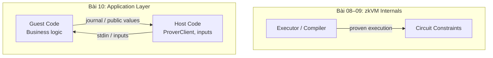

> **Prerequisites**: [[07-threat-models-zkvm|07. Threat Models in zkVM]]
> **Objectives**:
> - Hiểu class bugs xảy ra trong *application layer* — guest program logic
> - Nắm các pitfalls đặc thù của zkVM programming: integer overflow, type cast, nondeterminism
> - Biết các bugs từ việc dùng sai syscall/precompile API
> - Hiểu host-side bugs: DEV_MODE, mock prover, COMMIT ordering
> - Biết cách viết secure guest code

---

## Layer phân biệt

Trong bài này chúng ta rời khỏi *zkVM internals* và chuyển sang *application layer* — bugs trong code mà developer viết khi build ứng dụng dùng zkVM.



Điểm quan trọng: **Application bugs không break zkVM soundness** — prover vẫn phải prove execution thực sự. Nhưng nếu guest *logic* sai, proof prove sai logic đó → application bị exploit.

---

## Guest Code Bugs — Integer Overflow và Type Casting

> [!danger] Danger 10.1 — Overflow Trong Release Mode (Chi tiết)
>
> Rust panic on overflow trong debug mode, wrap silently trong release mode. Đây là nguồn bug rất phổ biến vì:
> - Guest programs **luôn compile release mode** trong production (performance requirement)
> - Developer test trong debug mode → không thấy overflow
>
> ```rust
> // Guest code — compile release, overflow-checks = false (mặc định)
> pub fn main() {
>     let price: u64 = io::read();    // 18_000_000_000_000_000_000 (gần u64::MAX)
>     let quantity: u64 = io::read(); // 2
>     
>     let total = price * quantity;   // BUG: wraps → 17_446_744_073_709_551_614
>     // Thực tế nên panic hoặc return error!
>     
>     io::commit(&total);             // Commit giá trị sai — proof valid cho giá trị sai
> }
>
> // FIX 1: Bật overflow-checks trong Cargo.toml
> // [profile.release]
> // overflow-checks = true
>
> // FIX 2: Dùng checked arithmetic
> let total = price.checked_mul(quantity)
>     .expect("Overflow in price calculation");
> ```

> [!danger] Danger 10.2 — Type Casting Truncation (`as` keyword)
>
> `overflow-checks = true` KHÔNG bắt được type cast truncation. `as` keyword trong Rust luôn truncate silently.
>
> ```rust
> // BUG: overflow-checks = true không giúp ở đây
> let large: u64 = 5_000_000_000;
> let small = large as u32;          // Silently truncates → 705_032_704
> io::commit(&small);                // Commits sai giá trị!
>
> // FIX: Dùng TryFrom
> use std::convert::TryFrom;
> let small = u32::try_from(large).expect("Value too large for u32");
> ```

> [!warning] Warning 10.3 — Floating Point Nondeterminism
>
> RISC-V floating point operations (`rv32imf`) có thể có behavior khác nhau tùy môi trường nếu không handled cẩn thận. Quan trọng hơn, **floating point là nondeterministic** nếu program depend on CPU-specific behavior.
>
> **Best practice**: Tránh floating point trong guest. Dùng fixed-point arithmetic hoặc integer arithmetic.

---

## Input Validation — Host là Untrusted

> [!definition] Definition 10.4 — Guest Phải Validate Inputs
> Trong zkVM, **host là untrusted**. Host cung cấp inputs cho guest, nhưng host có thể là malicious (adversarial prover). Guest code **phải validate** tất cả inputs trước khi dùng — zkVM không tự động sanitize.

```rust
// BUG: Trust inputs without validation
pub fn main() {
    let index: u32 = io::read();        // Could be anything
    let data: Vec<u64> = io::read();    // Could be empty
    
    // CRASH nếu index >= data.len() → panic trong guest
    let value = data[index as usize];
    io::commit(&value);
}

// BUG 2: Dùng input làm loop bound
let iterations: u32 = io::read();      // Host có thể set = u32::MAX
for i in 0..iterations {               // OOM / timeout → DoS
    // ... expensive computation
}

// FIXED
pub fn main() {
    let index: u32 = io::read();
    let data: Vec<u64> = io::read();
    
    // Validate trước khi dùng
    assert!(data.len() <= MAX_DATA_SIZE, "Input too large");
    assert!((index as usize) < data.len(), "Index out of bounds");
    
    let value = data[index as usize];
    io::commit(&value);
}
```

> [!note] Note 10.5 — Panic trong Guest không break Soundness
> Nếu guest panics, proof generation fail — nhưng proof system không bị compromise. Tuy nhiên:
> - Attacker dùng crafted input để DoS proving service
> - Nếu panic xảy ra trước `io::commit()`, committed values là empty/default

---

## Public vs Private Value Confusion

> [!danger] Danger 10.6 — Nhầm lẫn committed và private values
>
> `io::commit()` / `env::commit()` → public values (xuất hiện trong proof, verifier thấy)
> `io::read()` / `env::read()` → private inputs (chỉ guest thấy, không xuất hiện trong proof)
>
> **Attack scenario 1 — Lộ private key:**
>
> ```rust
> // BUG: Commit signature key material
> let private_key: [u8; 32] = io::read();   // Private input
> let signature = sign(&private_key, &message);
> io::commit(&signature);      // OK: signature là public
> io::commit(&private_key);    // BUG! Private key lộ ra proof!
> ```
>
> **Attack scenario 2 — Không commit đủ để verifier verify:**
>
> ```rust
> // BUG: Verifier không biết message được ký
> let message: Vec<u8> = io::read();       // Private — verifier không biết
> let valid = verify_signature(sig, &message, &pubkey);
> io::commit(&valid);       // Chỉ commit bool, không commit message!
>
> // Verifier chỉ biết: "signature là valid với *một* message nào đó"
> // Không biết message đó là gì → useless
>
> // CORRECT: Commit cả message hash
> let message_hash = sha256(&message);
> io::commit(&valid);
> io::commit(&message_hash); // Verifier biết signature valid với message này
> ```

---

## Nondeterminism trong Guest

> [!danger] Danger 10.7 — Nondeterministic Guest Execution
>
> zkVM require **deterministic execution** — cùng inputs luôn produce cùng outputs. Nondeterminism gây proof fail hoặc soundness issues.
>
> **Nguồn nondeterminism:**

**HashMap iteration order** (trước Rust 1.36, và vẫn có thể xảy ra với custom hashers):
```rust
// BUG: HashMap iteration không guaranteed deterministic
let mut map = HashMap::new();
map.insert("a", 1);
map.insert("b", 2);

let result: Vec<_> = map.iter().collect(); // Order may vary!
io::commit(&result);
// → Proof có thể vary theo run, hoặc fail với "determinism check"
```

**Non-deterministic randomness từ OS:**
```rust
// BUG: OS randomness không available trong zkVM
let random_bytes = rand::thread_rng().gen::<[u8; 32]>();
// → Panic hoặc return 0s trong zkVM environment

// CORRECT: Nhận randomness từ host (deterministic seed)
let seed: [u8; 32] = io::read(); // Host cung cấp seed
let rng = ChaCha20Rng::from_seed(seed);
```

**Thread-local storage**: Không có threads trong zkVM — thread-local variables không hoạt động như expected.

---

## Syscall và Precompile API Misuse

> [!danger] Danger 10.8 — Direct Syscall Bypass (SP1)
>
> Gọi trực tiếp `syscall_halt(0)` trong SP1 guest thay vì dùng normal program return:
>
> ```rust
> // DANGEROUS: Bypass normal commit/exit semantics
> use sp1_zkvm::syscalls::syscall_halt;
>
> pub fn main() {
>     let input: u64 = io::read();
>     let result = compute(input);
>     
>     // BUG: Halt trước khi commit — committed values unconstrained
>     syscall_halt(0);  // Bypasses deferred COMMIT flush!
>     
>     // io::commit() này không được thực thi!
>     io::commit(&result);
> }
>
> // CORRECT: Luôn dùng normal function return
> pub fn main() {
>     let input: u64 = io::read();
>     let result = compute(input);
>     io::commit(&result);
>     // Program returns normally → COMMIT syscalls được flush
> }
> ```

> [!warning] Warning 10.9 — Precompile Input Validation
>
> Khi gọi precompiles (trực tiếp hoặc qua patched crates), inputs phải hợp lệ:
>
> ```rust
> // BUG: Point nằm ngoài curve — undefined precompile behavior
> let point = io::read::<[u64; 4]>(); // Untrusted point
> // Không validate trước khi dùng!
> let result = k256::ProjectivePoint::from_bytes(&point); // May panic or corrupt
>
> // CORRECT: Validate point trước
> let point_bytes: [u8; 33] = io::read();
> let point = k256::EncodedPoint::from_bytes(&point_bytes)
>     .expect("Invalid point encoding");
> let point = k256::AffinePoint::from_encoded_point(&point)
>     .expect("Point not on curve");
> ```

---

## Host-Side Bugs

Host bugs không break circuit security, nhưng ảnh hưởng đến application correctness:

> [!danger] Danger 10.10 — DEV_MODE / Mock Prover trong Production
>
> Risc0: `RISC0_DEV_MODE=1` — fake receipts, bypass proof  
> SP1: `ProverClient::mock()` — no real proof
>
> Đây đã được cover trong Lesson 04/05, nhưng cần nhắc lại: **production environment phải explicitly disable** development modes.
>
> ```rust
> // Risc0: Host-side detection
> // Nếu bạn build verifier, luôn check:
> fn verify_receipt(receipt: &Receipt) -> bool {
>     // Fail hard nếu dev mode đang active
>     if receipt.is_dev_mode() {
>         panic!("Dev mode receipts not accepted in production!");
>     }
>     receipt.verify(IMAGE_ID).is_ok()
> }
>
> // Cargo.toml: prevent dev-mode in production build
> // [features]
> // dev = ["risc0-zkvm/dev-mode"]
> // NEVER include "dev" in production build
> ```

> [!danger] Danger 10.11 — Risc0 COMMIT Ordering
>
> Trong Risc0, `env::commit()` values được đọc từ journal *theo thứ tự commit*. Nếu verifier đọc journal theo thứ tự khác với guest commit, giá trị bị misparse.
>
> ```rust
> // Guest commits: (price, quantity, total)
> env::commit(&price);
> env::commit(&quantity);
> env::commit(&total);
>
> // BUG trong host — đọc sai thứ tự:
> let total: u64 = receipt.journal.decode()?;   // Reads price as total!
> let price: u64 = receipt.journal.decode()?;   // Reads quantity as price!
> // Logic error nhưng proof valid!
> ```

---

## Assumption Resolution Bug — Risc0 Composition

> [!danger] Danger 10.12 — Unresolved Assumptions trong zkVM Composition
>
> Khi dùng Risc0 *proof composition* (một guest verify proof của guest khác), kết quả là một `Receipt` với danh sách **assumptions** — các inner proofs chưa được fully verified.
>
> **Bug**: Nếu application verify outer receipt nhưng không kiểm tra assumptions đã được resolved, attacker có thể submit receipt với unresolved assumptions.
>
> ```rust
> // Guest A verify proof của Guest B (composition)
> let inner_receipt: Receipt = env::read(); // Được cung cấp bởi host
> env::verify(GUEST_B_IMAGE_ID, &inner_receipt.journal)?;
> // Assumption được add: "Guest B proof is valid"
>
> // HOST — BUG: Không resolve assumptions
> let outer_receipt = prover.prove(guest_a_elf, ...)?;
> verifier.verify(&outer_receipt)?; // FAIL nếu assumptions unresolved
>
> // HOST — CORRECT
> let outer_receipt = prover.prove(guest_a_elf, ...)?
>     .with_assumptions(vec![inner_receipt])?; // Resolve assumptions!
> verifier.verify(&outer_receipt)?;
> ```

---

## Checklist Viết Secure Guest Code

1. **Bật `overflow-checks = true`** trong `[profile.release]` của guest `Cargo.toml`
2. **Dùng `try_from` / `checked_*`** thay vì `as` cast và unchecked arithmetic
3. **Validate tất cả inputs** từ `io::read()` trước khi dùng
4. **Giới hạn loop bounds** từ untrusted inputs
5. **Không commit private data** — review mỗi `io::commit()` call
6. **Commit đủ context** cho verifier (message hash, không chỉ bool)
7. **Tránh nondeterminism**: HashMap, thread-local, OS randomness
8. **Không dùng syscall_halt** trực tiếp trong SP1
9. **Luôn dùng patched crates** đúng version trong SP1
10. **Disable DEV_MODE** trong production — enforce via Cargo features

---

## Summary

- **Application layer bugs** không break zkVM soundness, nhưng break application security.
- **Integer overflow** trong release mode là silent — set `overflow-checks = true`.
- **Type cast với `as`** không được bắt bởi overflow-checks — dùng `TryFrom`.
- **Host là untrusted** — guest phải validate tất cả inputs.
- **Public vs private confusion** — review mỗi `commit()` call.
- **Nondeterminism** (HashMap, OS randomness) gây proof fail hoặc soundness issues.
- **syscall_halt** trong SP1 bypass COMMIT flush → committed values unconstrained.
- **Composition** trong Risc0 cần explicitly resolve assumptions.
- **DEV_MODE** phải bị disable trong production — enforce via Cargo features, không chỉ environment variables.

---

## References

- 7BlockLabs — Auditing zkVM Guest Programs Checklist: https://www.7blocklabs.com/blog/auditing-zkvm-guest-programs-a-checklist-inspired-by-2025s-sp1-security-guidance
- Sigma Prime — SP1 Security Auditor's Guide: https://blog.sigmaprime.io/sp1-zkvm-security-guide.html
- Veridise — Writing and Auditing Secure zkVM Applications (Part III): https://veridise.com/blog/zero-knowledge/writing-and-auditing-secure-zkvm-applications/
- LambdaClass — SP1 Exploit (is_complete + COMMIT syscall): https://blog.lambdaclass.com/responsible-disclosure-of-an-exploit-in-succincts-sp1-zkvm-found-in-partnership-with-3mi-labs-and-aligned-which-arises-from-the-interaction-of-two-distinct-security-vulnerabilities/
