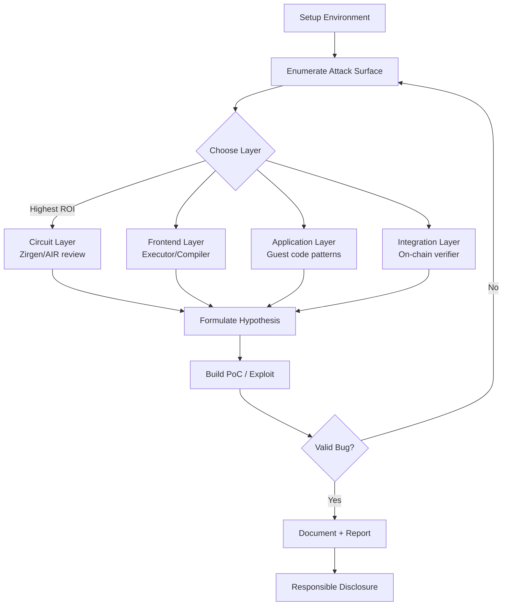

> **Prerequisites**: Tất cả lessons trước, đặc biệt [[06-zk-bug-taxonomy|06]], [[07-threat-models-zkvm|07]], [[12-zkverify-architecture|12]], [[13-real-world-cves|13]]
> **Objectives**:
> - Xây dựng systematic methodology để hunt bugs trong Risc0/SP1/zkVerify
> - Biết cách prioritize effort: layer nào, class nào, tool nào
> - Hiểu quy trình từ setup environment → enumerate attack surface → audit → PoC → report
> - Nắm best practices cho responsible disclosure và bug bounty submission

---

## Tổng quan Methodology

Bug hunting trong zkVM không giống web security hay binary exploitation. Ta cần kết hợp:
- **Cryptography knowledge**: Hiểu circuit constraints, field arithmetic
- **Systems security**: Rust code auditing, executor semantic analysis
- **Protocol analysis**: Fiat-Shamir transcript, cross-chain attestation
- **Smart contract auditing**: On-chain verifier, integration bugs



---

## Phase 1 — Setup Environment

**Cài đặt toolchain:**

```bash
# Risc0
curl -L https://risczero.com/install | bash
rzup install        # Install latest rzup
cargo install cargo-risczero

# SP1
curl -L https://sp1.succinct.xyz | bash
sp1up               # Install latest SP1 toolchain

# Rust + additional tools
rustup target add riscv32im-unknown-none-elf
cargo install cargo-fuzz  # For fuzzing

# Audit tools
cargo install cargo-audit  # Check known CVEs in deps
cargo install cargo-geiger  # Detect unsafe code usage
```

**Clone và setup target repos:**

```bash
# Risc0 core
git clone https://github.com/risc0/risc0
git clone https://github.com/risc0/zirgen  # Circuit DSL

# SP1 core
git clone https://github.com/succinctlabs/sp1

# zkVerify
git clone https://github.com/zkVerify/zkVerify
git clone https://github.com/zkVerify/risc0-verifier

# Build
cd risc0 && cargo build
cd sp1 && cargo build
```

**Verify bạn có thể run tests:**

```bash
# Risc0: Test một số circuit components
cd risc0/circuit/rv32im && cargo test

# SP1: Run integration tests
cd sp1 && cargo test --test integration

# zkVerify: Test pallets
cd zkVerify && cargo test -p pallet-risc0-verifier
```

---

## Phase 2 — Enumerate Attack Surface

### 2a. Circuit Layer (Risc0 — Zirgen)

```bash
# Tìm tất cả NondetReg usage
grep -rn "NondetReg()" zirgen/circuit/ --include="*.zir"

# Tìm NondetTwitReg — potential wrong range
grep -rn "NondetTwitReg()" zirgen/circuit/ --include="*.zir"

# Tìm conditional constraints
grep -rn "If\|when\|cond" zirgen/circuit/ --include="*.zir"

# Liệt kê tất cả instruction components
ls zirgen/circuit/rv32im/src/
```

Key files để review trong Risc0 Zirgen:
- `zirgen/circuit/rv32im/src/inst.zir` — instruction dispatch
- `zirgen/circuit/rv32im/src/mux.zir` — multiplexer cho instructions
- `zirgen/circuit/rv32im/src/div.zir` — division
- `zirgen/circuit/rv32im/src/multiply.zir` — multiplication
- `zirgen/circuit/rv32im/src/mem.zir` — memory access

### 2b. Circuit Layer (SP1 — AIR Chips)

```bash
# Tìm tất cả chip implementations
find sp1/crates/core-machine -name "*.rs" | grep chip

# Tìm assert_bool calls (missing ones = potential bug)
grep -rn "assert_bool\|assert_eq" sp1/crates/core-machine/src/

# Tìm prover-supplied witnesses
grep -rn "local\[COL_\|main.row_slice" sp1/crates/core-machine/src/
```

### 2c. Executor / Frontend

```bash
# Risc0 executor — semantic mismatches
find risc0/circuit/rv32im/src/execute -name "*.rs"
# Xem đặc biệt: rv32im.rs, mux.rs

# SP1 executor
find sp1/crates/emulator -name "*.rs"
```

### 2d. Integration (zkVerify)

```bash
# Pallet verifier code
cat zkVerify/pallets/verifiers/risc0/src/lib.rs
cat zkVerify/pallets/verifiers/sp1/src/lib.rs

# On-chain contracts (nếu available)
find zkVerify -name "*.sol"
```

---

## Phase 3 — Audit Frameworks

### 3a. Circuit Audit Checklist

Cho mỗi instruction trong RISC-V rv32im (tổng ~47 instructions):

```
□ ADD, SUB: overflow handling trong field arithmetic?
□ MUL, MULH, MULHU, MULHSU: carry/overflow constraints?
□ DIV, DIVU, REM, REMU: rs2=0 edge case? INT_MIN/-1 edge case?
□ SLL, SRL, SRA, SRLI, SRAI: shift amount masked to 5 bits?
□ LUI, AUIPC: immediate field constraints?
□ BEQ, BNE, BLT, BGE, BLTU, BGEU: comparison underconstrained?
□ LW, LH, LB, LWU, LHU, LBU: sign extension constraints?
□ SW, SH, SB: store mask constraints?
□ JAL, JALR: PC alignment? link register constraints?
□ ECALL: syscall number routing constraints?
```

Cho mỗi precompile:

```
□ SHA-256: all 80 rounds constrained? padding correct?
□ Keccak: permutation fully constrained? rate/capacity separation?
□ secp256k1: point-at-infinity case? field membership check?
□ ed25519: cofactor handling? point decompression constraints?
□ Poseidon2: sponge state constraints? external call interface?
```

### 3b. Executor Audit Checklist

```
□ DIV by zero: does executor return -1 (not panic)?
□ INT_MIN / -1: signed overflow case handled?
□ Shift amount masking: rs2 & 0x1F applied?
□ Load sign extension: LH/LB properly sign-extend to 32 bits?
□ ECALL: syscall dispatch matches circuit's ecall handling?
□ Memory alignment: misaligned access behavior matches spec?
□ Segment boundaries: register/memory state transferred correctly?
□ next_pc at completion: terminal state enforced?
```

### 3c. Application / Integration Checklist

```
□ vkey/imageId hardcoded in verifier?
□ Public values validated for range and business logic?
□ Nullifiers tracked for replay prevention?
□ Journal decode order matches guest commit order?
□ Aggregation: inner proof imageIDs verified?
□ Attestation contract: replay protection?
□ overflow-checks = true in guest Cargo.toml?
□ No as-casts for user-controlled values?
□ No nondeterministic operations (HashMap, OS rand)?
□ DEV_MODE/mock prover disabled in production?
```

---

## Phase 4 — Tools và Techniques

### Automated Tools

**Picus (Veridise) — Underconstrained detection:**
```bash
# Picus takes Zirgen/AIR specifications, outputs underconstrained report
# Not publicly available as open-source tool (commercial/collaboration)
# Risc0 + Veridise use it internally
# Conceptually: encode constraints as SMT, query for multiple witnesses
```

**ARGUZZ — Soundness/Completeness Fuzzing:**
```bash
# Clone ARGUZZ (research tool)
git clone https://github.com/christoff-buerger/arguzz  # if available

# Concept: fault injection into prover, check verifier still accepts
# Automated exploration of instruction mutation space
```

**cargo-audit — Known CVE checking:**
```bash
cargo audit
# Checks Cargo.lock against RustSec Advisory Database
# Flags known CVEs in dependencies
```

**Differential Testing — Executor vs RISC-V Reference:**
```bash
# Spike (official RISC-V ISA simulator)
# QEMU with RISC-V support

# Run same program on both:
# 1. zkVM executor (Risc0/SP1)
# 2. Spike/QEMU

# Compare: register states, memory, output after each instruction
# Divergence = potential semantic mismatch bug
```

### Manual Techniques

**Zirgen constraint enumeration:**
```python
# Script để đếm constraints per component
import subprocess
result = subprocess.run(
    ['grep', '-c', '===', 'zirgen/circuit/rv32im/src/inst.zir'],
    capture_output=True, text=True
)
# Ít constraints = potential underconstraining
```

**Trace analysis:**
```rust
// Thêm custom trace logging vào executor
// Sau mỗi instruction, dump: pc, registers, memory changes
// Compare với expected RISC-V semantics
```

---

## Phase 5 — Building Proof of Concept

Khi bạn tìm được potential bug, cần prove nó là exploitable:

**Cho circuit underconstrained bug:**

```rust
// PoC template: modified prover generate fake witness
// 1. Fork risc0 hoặc sp1 prover
// 2. Trong witness generation, inject crafted witness
// 3. Submit to honest verifier
// 4. Verify verifier accepts

// Example: Prove 7 % 5 = 50000 (CVE-2025-52484 style)
fn malicious_prove_remu(a: u32, b: u32, fake_result: u32) -> Receipt {
    // Craft execution trace where:
    // - instruction = REMU x5, x1, x2
    // - rs1_val = a (correct)
    // - rs2_val = a (WRONG: should be b, but set to a)
    // - rd = fake_result (prover claims this value)
    // Submit this crafted trace to prover
    // If circuit bug exists, proof generates and verifies
}

// Verify the forged proof passes honest verifier
let receipt = malicious_prove_remu(100, 7, 50000);
receipt.verify(IMAGE_ID).expect("Should accept — this is the bug!");
println!("Proved: 100 % 7 = 50000");  // Should never print without bug
```

**Cho Fiat-Shamir bug:**

```python
# Solve for valid public_values given the Fiat-Shamir equations
# a * claim + b = expected  →  claim = (expected - b) / a
# Submit forged claim as proof public values
```

**Severity assessment:**
- **Critical**: Forge proof cho arbitrary false statement
- **High**: Forge proof cho specific class of false statements
- **Medium**: DoS / completeness failure
- **Low**: Privacy leak / theoretical ZK property violation

---

## Phase 6 — Responsible Disclosure

### Bug Bounty Programs

| Platform | Scope | Max Bounty |
|----------|-------|-----------|
| HackenProof — Risc0 | risc0-zkvm crate, Risc0 circuits | $100k+ (critical) |
| Immunefi — SP1 | SP1 zkVM, Succinct contracts | Up to $2M |
| zkVerify — (check program) | zkVerify pallets, contracts | Varies |

### Disclosure Timeline Best Practices

```
Day 0:   Discover and verify bug
Day 1:   Report to vendor (security@risc0.com, security@succinct.xyz)
Day 3:   Vendor acknowledgment expected
Day 14:  If no response → escalate via bug bounty platform
Day 90:  Standard disclosure deadline (coordinated with vendor)
Day 91+: Public disclosure (if vendor unresponsive)
```

### Report Template

```markdown
## Summary
[1-2 câu mô tả bug ngắn gọn]

## Severity
Critical / High / Medium / Low

## Affected Versions
risc0-zkvm: X.Y.Z (và trở về trước)

## Root Cause
[Technical explanation với code references]

## Attack Vector
[Step-by-step: ai có thể exploit, cần điều kiện gì]

## Impact
[Hậu quả cụ thể: proof forgery? DoS? Privacy leak?]

## Proof of Concept
[Code hoặc steps để reproduce]

## Suggested Fix
[Nếu có đề xuất]

## References
[Related CVEs, papers, code locations]
```

---

## Prioritization Guide

Với giới hạn thời gian, nên ưu tiên:

**Tier 1 — Highest ROI (Circuit Layer):**
- Review Zirgen code cho mỗi instruction — tìm missing constraints
- Focus: `NondetReg()` không có explicit constraint, conditional branches, register read enforcement
- Tool: Manual + Picus (nếu có access)

**Tier 2 — High ROI (New Instructions/Precompiles):**
- Mỗi khi Risc0/SP1 thêm instruction mới hoặc precompile mới → potential underconstrained bug
- Track release notes cho "new precompile" announcements

**Tier 3 — Medium ROI (Integration/Application):**
- Kiểm tra on-chain verifier contracts — vkey bypass là bug bounty classic
- Review zkVerify pallet code — mới, ít được audited hơn Risc0/SP1 core

**Tier 4 — Lower ROI (Backend/Fiat-Shamir):**
- Đòi hỏi deep protocol knowledge
- Risc0/SP1 backends đã được audited nhiều lần
- zkVerify backend ít được audited → potential opportunity

---

## Mindset và Tips Thực Tế

> [!note] Note 14.1 — "Read the Spec, then Read the Code"
> Với mỗi RISC-V instruction, luôn:
> 1. Đọc RISC-V spec cho instruction đó (đặc biệt edge cases)
> 2. Đọc circuit implementation
> 3. Hỏi: "Circuit có enforce đúng tất cả edge cases không?"

> [!note] Note 14.2 — Tìm Bổ sung, không chỉ tìm Lỗi
> Nhiều underconstrained bugs không phải là code *sai* — chúng là code *thiếu*. Hỏi "cái gì còn thiếu?" thay vì chỉ "cái gì sai?".

> [!note] Note 14.3 — Follow Recent Changes
> Bugs thường xuất hiện khi code mới được thêm:
> ```bash
> git log --oneline --since="3 months ago" risc0/circuit/rv32im/
> # Review commits thêm instructions mới, precompiles mới
> # Những chỗ mới = ít được tested và audited nhất
> ```

> [!note] Note 14.4 — Cross-zkVM Patterns
> Nếu một bug (như LUI underconstrained) tồn tại trong Risc0 và Jolt, có thể cùng bug tồn tại ở SP1, Nexus, hay zkVerify's reimplementation. Sau khi tìm bug ở một system, check các systems khác.

---

## Summary

- Bug hunting trong zkVM cần kết hợp: cryptography, systems security, protocol analysis, smart contract auditing.
- **Prioritize circuit layer**: ~97% circuit bugs là underconstrained — ROI cao nhất.
- **Setup properly**: Build Risc0/SP1/zkVerify từ source, run tests, có môi trường để test PoC.
- **Systematic enumeration**: Review mỗi instruction, mỗi precompile, mỗi chip — không bỏ sót.
- **Tools**: ARGUZZ cho fuzzing, cargo-audit cho deps, differential testing với RISC-V reference simulator.
- **PoC là bắt buộc**: Một bug chưa có PoC là một finding chưa hoàn chỉnh.
- **Responsible disclosure**: Follow coordinated disclosure, dùng bug bounty platforms.
- **Follow changes**: Bugs thường xuất hiện trong code mới nhất.

---

## References

- HackenProof — RISC Zero Bug Bounty: https://hackenproof.com/programs/risc-zero-zkvm
- Immunefi — SP1 Bug Bounty: https://immunefi.com/bug-bounty/succinct/
- RISC-V Specification v2.2: https://riscv.org/wp-content/uploads/2017/05/riscv-spec-v2.2.pdf
- Sigma Prime — SP1 Security Auditor's Guide: https://blog.sigmaprime.io/sp1-zkvm-security-guide.html
- Veridise — Identifying Common Vulnerabilities in zkVMs: https://veridise.com/blog/zero-knowledge/identifying-common-vulnerabilities-in-zkvms/
- ARGUZZ Paper: https://arxiv.org/pdf/2509.10819
- Chaliasos et al. — SoK: SNARK Vulnerabilities (USENIX 2024): https://arxiv.org/pdf/2402.15293
- zksecurity.xyz — zkVM Security Overview: https://blog.zksecurity.xyz/posts/zkvm-security/
